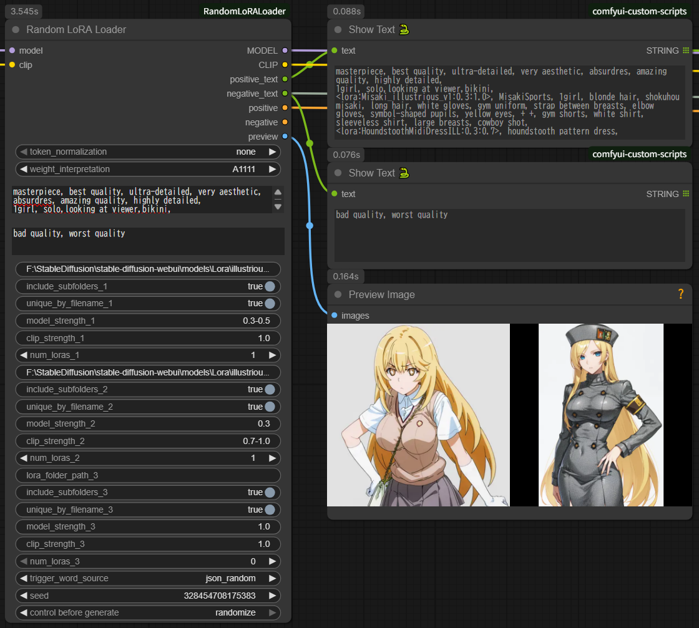
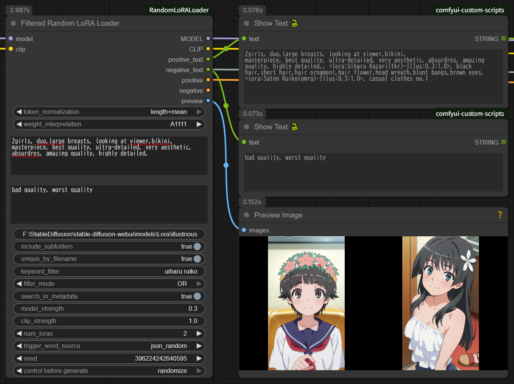
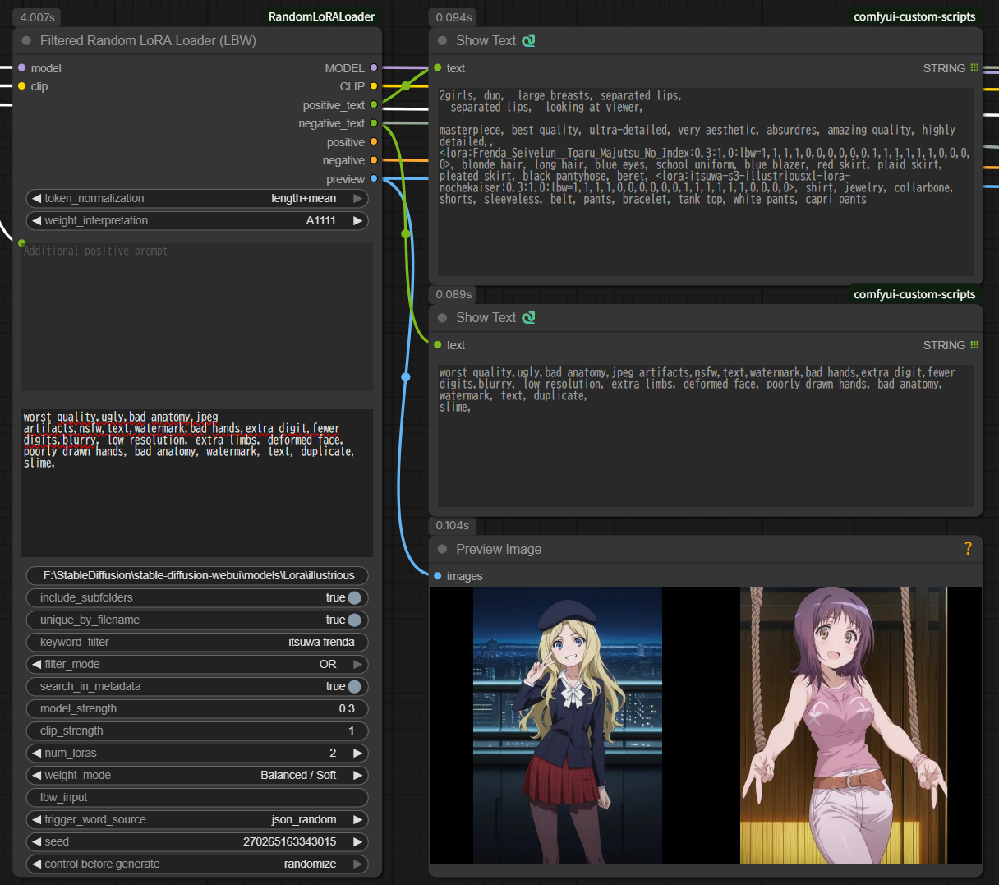
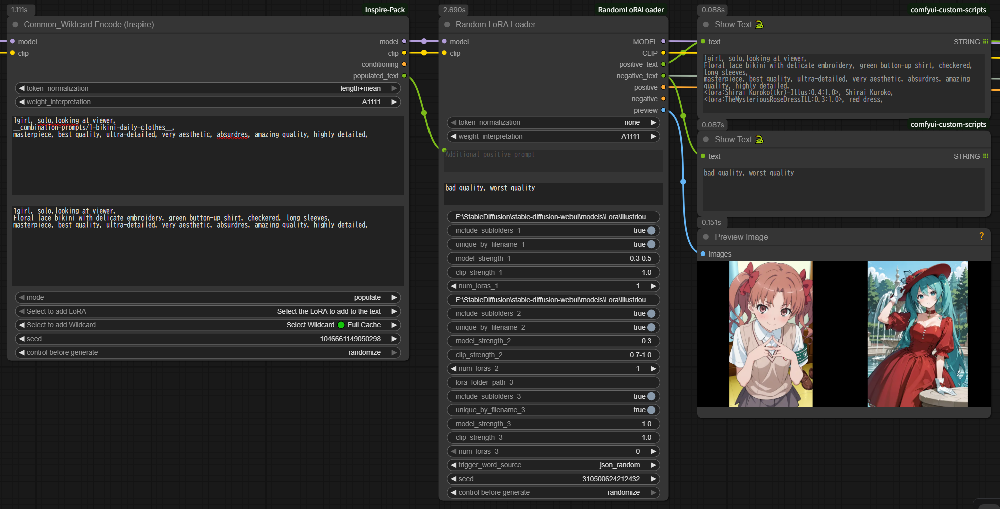
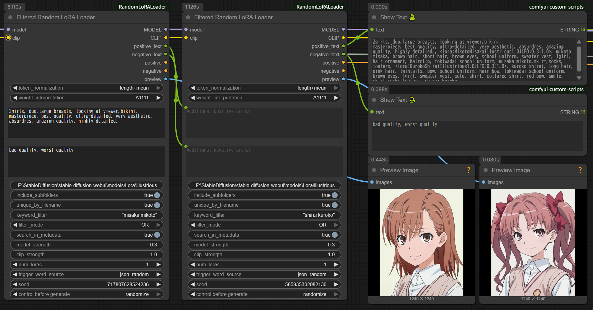

# Random LoRA Loader for ComfyUI

**English | [日本語版 README](./README_ja.md)**

A ComfyUI custom node package for randomly selecting and applying LoRAs. Includes three nodes:

1. **Random LoRA Loader** - Select from 3 folders simultaneously
2. **Filtered Random LoRA Loader** - Single folder with keyword filtering
3. **Filtered Random LoRA Loader (LBW)** - 🆕 LBW support with automatic SD1.5/SDXL detection (NEW v1.2.0)





---

## ⚠️ Important: Supported Models

**These nodes are designed for SD1.5 and SDXL models ONLY.**

- ✅ **Supported:** Stable Diffusion 1.5, Stable Diffusion XL (SDXL)
- ❌ **NOT Supported:** Flux, SD3, SDXL Turbo, Pony, or other architectures

The LBW node's block weight feature specifically targets SD1.5/SDXL U-Net architecture. Other model types will not work correctly with LBW.

---

## Nodes Overview

### Random LoRA Loader (Original)

Select LoRAs from up to 3 different folders. Ideal for folder-based organization.

**Use case:**
- Different folders for styles, characters, concepts
- Fixed LoRA categories
- Simple folder-based workflow

### Filtered Random LoRA Loader

Select LoRAs from a single folder using keyword filtering. Ideal for dynamic selection and large collections.

**Use case:**
- All LoRAs in one folder, filter by keywords
- Dynamic filtering with AND/OR conditions
- Metadata search capability
- Recommended for chaining multiple instances

### Filtered Random LoRA Loader (LBW) 🆕 NEW v1.2.0

Advanced node with LoRA Block Weight (LBW) support for precise effect control.

**Use case:**
- Separate control of style vs. structure
- Fine-tuned LoRA application
- Professional workflows requiring precision
- 4 preset modes + custom input

**See [README_LBW.md](README_LBW.md) for detailed LBW documentation.**

---

## Key Features

### Common Features (All Nodes)

- **Multi-Source Metadata Reading**: Automatically retrieve trigger words and sample prompts with priority order:
  1. `.metadata.json` format (ComfyUI Lora Manager) - Priority 1
  2. `.info` format (Civitai Helper) - Priority 2
  3. **Embedded metadata in LoRA file** - Priority 3
- **Strength Randomization**: 
  - **Range specification with negative support**: `0.4-0.8`, `-0.8--0.3` (v1.2.0)
  - **0.1 increments for ranges**: Easier to observe effect differences
  - **Fixed values rounded to 2 decimals**: `0.847` → `0.85`
- **Flexible Trigger Word Retrieval**:
  - `json_combined`: Combine all trigger word patterns (with deduplication)
  - `json_random`: Randomly select one pattern
  - `json_sample_prompt`: Randomly retrieve sample prompts
  - `metadata`: Read directly from embedded metadata
- **Sample Prompt Optimization**: Automatically remove LoRA syntax from samples and apply node-configured strength
- **Dual Text Outputs**: Separate positive_text and negative_text outputs
- **ComfyUI Standard Seed Control**: Supports fixed/randomize/increment/decrement
- **Wildcard Encode Integration**: Works seamlessly with Wildcard Encode (Inspire)
- **LoRA Syntax Auto-Removal**: Cleans up LoRA syntax in additional_prompt to prevent noise
- **Preview Image Support**: Display preview images/videos for selected LoRAs (v1.1.0)
- **Duplicate Filename Handling**: Exclude duplicate filenames across subfolders (v1.1.0)

### Filtered Nodes (Filtered & LBW)

- **Keyword Filtering**: Space-separated keywords with phrase support
- **AND/OR Modes**: Flexible filtering logic
- **Metadata Search**: Search in filenames or embedded metadata
- **Fast Caching**: Instant metadata access after first load

### LBW Node Only 🆕

- **LoRA Block Weight Support**: Control which U-Net blocks are affected
- **Automatic SD1.5/SDXL Detection**: No manual model type selection needed
- **4 Preset Modes**:
  - Style Focused - OUTPUT blocks only
  - Character Focused - Balanced IN+MID+OUT
  - Structure/Composition Only - INPUT+MID blocks only
  - Balanced / Soft - Gentle application
- **Preset: Random Mode**: Randomly select one of the 4 presets
- **Direct Input Mode**: Custom weight specification
- **Automatic Weight Adjustment**: Handles mismatched element counts

---

## Installation

### ⚠️ Optional: Video Preview Support

**For video file preview (.mp4, .webm, .avi, .mov), opencv-python is REQUIRED:**

```bash
pip install opencv-python
```

**Without opencv-python:**
- ✅ Static images (.png, .jpg, .jpeg) work
- ✅ Animated images (.gif, .webp) work  
- ❌ **Video files will show BLACK SCREEN** (with warning message in console)

LoRA functionality works normally regardless of opencv-python installation. Only preview display is affected.

### Requirements

- ComfyUI (works with standard installation)
- Python 3.9+
- **Core dependencies included with ComfyUI** ✅

### Steps

```bash
cd ComfyUI/custom_nodes
git clone https://github.com/YOUR_USERNAME/RandomLoRALoader.git
# Or manually create RandomLoRALoader folder and copy files
```

Restart ComfyUI.

**Note:** Uses only Python standard library and ComfyUI bundled libraries for core functionality. opencv-python is optional for video preview only.

### Uninstallation

```bash
# Navigate to custom_nodes folder
cd ComfyUI/custom_nodes

# Remove RandomLoRALoader folder
rm -rf RandomLoRALoader

# On Windows
rmdir /s RandomLoRALoader
```

Or manually delete the RandomLoRALoader folder and restart ComfyUI.

---

## Usage

### Basic Usage (Random LoRA Loader)

1. **Add Node**: Search for "Random LoRA Loader" in the node browser
2. **Connect MODEL/CLIP**: Connect base model and CLIP to inputs
3. **Set Folder Paths**: 
   - Group 1: Style LoRA folder path
   - Group 2: Character LoRA folder path (optional)
   - Group 3: Concept LoRA folder path (optional)
4. **Configure Each Group**:
   - `num_loras`: Number of LoRAs to select from each group
   - `model_strength` / `clip_strength`: Application strength (fixed value or random range)
5. **Connect Outputs**:
   - `MODEL` / `CLIP`: Connect to KSampler
   - `positive` / `negative`: Connect to Set Conditioning or KSampler
   - `positive_text` / `negative_text`: Connect to Show Text for verification (recommended)

### Wildcard Encode Integration (Recommended)

This node works seamlessly with Wildcard Encode (Inspire) for dynamic prompt generation combined with random LoRA selection.



#### Recommended Connection

```
[Wildcard Encode (Inspire)]
  text: "__style__, {red|blue|green}, <lora:base_effect:0.5>"
  ↓
  ├─ populated_text ──→ [Random LoRA Loader]
  │                     additional_prompt_positive
  └─ MODEL/CLIP ──────→ model/clip input
  
[Random LoRA Loader]
  Folder 1: character LoRAs
  Folder 2: concept LoRAs
  ↓
  MODEL/CLIP/CONDITIONING → [KSampler]
```

#### How It Works

1. **Wildcard Encode Processing**:
   - Wildcard expansion: `__style__` → "anime style"
   - Choice expansion: `{red|blue|green}` → "blue"
   - LoRA syntax processing: `<lora:base_effect:0.5>` → applied to MODEL
   - Result: `populated_text` = "anime style, blue, <lora:base_effect:0.5>"

2. **Random LoRA Loader Processing**:
   - **Auto-removes LoRA syntax** from `populated_text`: "anime style, blue"
   - Random LoRA selection: character_alice, concept_magic
   - Final prompt: "anime style, blue, alice, blonde hair, magic circle"
   - MODEL/CLIP: base_effect + character_alice + concept_magic (all applied)

#### Benefits

- ✅ Delegate wildcard functionality to Wildcard Encode (specialized tool)
- ✅ Delegate random LoRA selection to this node (simple configuration)
- ✅ Prompt information fully inherited
- ✅ LoRA syntax automatically cleaned (no noise)

### 3-Group Example

```
Group 1: style LoRAs
  - num_loras_1: 2
  - model_strength_1: "0.6-0.9"  ← Random (0.1 increments)
  - clip_strength_1: "0.6-0.9"   ← Random (0.1 increments)

Group 2: character LoRAs
  - num_loras_2: 1
  - model_strength_2: "1.0"      ← Fixed
  - clip_strength_2: "1.0"       ← Fixed

Group 3: Unused
  - lora_folder_path_3: (empty)
  - num_loras_3: 0

→ Result: 2 style LoRAs (variable strength) + 1 character LoRA (fixed strength) = 3 LoRAs total
```

---

## Settings

### Folder Scanning

All three nodes scan the folders you point them at the same way.

**Supported extensions:** `.safetensors`, `.pt`, `.ckpt` (case-insensitive).

> Note: `.pt` and `.ckpt` files have no readable embedded metadata, so trigger words for them come only from `.metadata.json` / `.info` sidecar files.

**Symbolic links are followed.** A subfolder that is a symlink is descended into, matching ComfyUI's own folder scan — so LoRAs that only exist behind a link are included as candidates, just as they appear in ComfyUI's native LoRA dropdown. Link loops are detected and skipped rather than hanging the scan, and a folder reachable through two different links is only scanned once.

**The candidate list is sorted before selection.** This makes a given `seed` reproduce the same selection on any machine. Prior to v1.3.0 the order came straight from the filesystem, so the same seed could pick different LoRAs on a different PC.

> ⚠️ Because the ordering changed, an existing workflow may select a different set of LoRAs after upgrading to v1.3.0, even with a fixed seed. If a result you were relying on changes, re-roll or re-pick the seed.

### Common Settings

| Setting | Description | Default |
|---------|-------------|---------|
| `token_normalization` | Token normalization method | `none` |
| `weight_interpretation` | Prompt emphasis notation interpretation | `A1111` |
| `additional_prompt_positive` | Additional positive prompt (combined with trigger words) | (empty) |
| `additional_prompt_negative` | Additional negative prompt | (empty) |
| `trigger_word_source` | Trigger word source | `json_combined` |
| `seed` | Random selection seed | `0` |

#### Important Notes on additional_prompt

**Supported:**
- Regular prompt text
- Text input from other nodes (e.g., Wildcard Encode's `populated_text`)

**Not Supported (automatically removed):**
- `<lora:xxx:0.8>` format LoRA syntax
- `{a|b|c}` format wildcard syntax
- `__filename__` format wildcard syntax

**Why:**
- This node applies LoRAs via folder specification
- Wildcard functionality should be handled by dedicated nodes (Wildcard Encode, etc.)
- Writing LoRA syntax causes **filename to become meaningful tokens as noise**

**Example (problematic case):**
```
Input: "1girl, <lora:anime_style:0.8>, beautiful"
↓
CLIP tokenization: [1girl, lora, anime, style, 0, 8, beautiful]
                            ^^^^^ ^^^^^
                            Unintended words added to prompt ❌
```

**Correct usage:**
```
additional_prompt_positive: "1girl, beautiful"  ← No LoRA syntax ✅
LoRA application: Use folder specification feature ✅
```

Or, when connecting from Wildcard Encode, LoRA syntax is automatically removed:
```
[Wildcard Encode] populated_text: "1girl, <lora:style:0.8>, beautiful"
       ↓
[This Node] additional_prompt_positive received → LoRA syntax auto-removed
       ↓
Final prompt: "1girl, beautiful" ✅
```

### Group Settings (1-3)

Each group can be configured individually:

| Setting | Description | Default |
|---------|-------------|---------|
| `lora_folder_path_X` | LoRA folder absolute path | (empty) |
| `include_subfolders_X` | Include subfolders (symbolic links are followed) | `true` |
| `unique_by_filename_X` | Exclude duplicate filenames | `true` |
| `model_strength_X` | MODEL application strength | `"1.0"` |
| `clip_strength_X` | CLIP application strength | `"1.0"` |
| `num_loras_X` | Number of LoRAs to select | Group 1: `1`, Groups 2/3: `0` |

---

## Strength Specification (Important)

Strength fields accept **fixed values** or **random ranges**, including **negative values**.

### Fixed Value

```
Input: "1.0"
→ Always applied at 1.0

Input: "0.55"
→ Rounded to 0.55 (2 decimals)

Input: "-0.5"
→ Negative LoRA at -0.5 ✅ (v1.2.0)
```

### Random Range

**Format:** `min-max`

```
Input: "0.6-0.9"
→ Random from [0.6, 0.7, 0.8, 0.9] (0.1 increments)

Input: "-0.8--0.3"
→ Random from [-0.8, -0.7, -0.6, -0.5, -0.4, -0.3] ✅ (v1.2.0)

Input: "-0.5-0.5"
→ Random from [-0.5, -0.4, ..., 0.4, 0.5] ✅
```

**v1.2.0 Improvements:**
- ✅ **Negative range support**: `-0.8--0.3` now works correctly
- ✅ **0.1 increments for all ranges**: Easier to observe effect differences
- ✅ **Fixed values rounded to 2 decimals**: `0.847` → `0.85`

### Behavior

**All Nodes:**
- Range: 0.1 increments list → random selection
- Fixed: Rounded to 2 decimals

**Example:**
```
model_strength_1: "0.6-0.9"
→ Each execution randomly selects from [0.6, 0.7, 0.8, 0.9]
→ Console: "[RandomLoRALoader] Selected strength: 0.7"
```

---

## MODEL Strength vs CLIP Strength

### MODEL Strength
- **Affects**: Image itself (art style, composition, colors, shapes)
- **Effect**: Visual characteristics of generated image
- **Example**: 
  - High value: Strong art style transfer
  - Low value: Subtle style hints

### CLIP Strength
- **Affects**: Prompt interpretation (concept understanding, language-image association)
- **Effect**: How strongly the model follows prompt instructions
- **Example**:
  - High value: Strong semantic guidance from trigger words
  - Low value: Weak semantic influence

### Recommended Settings

**For most use cases:**
```
model_strength: 0.8
clip_strength: 0.8
→ Balanced application
```

**For subtle style application:**
```
model_strength: 0.4-0.6
clip_strength: 0.8-1.0
→ Light visual effect, strong semantic guidance
```

**For strong style override:**
```
model_strength: 1.0-1.2
clip_strength: 0.6-0.8
→ Strong visual effect, moderate semantic guidance
```

---

## Trigger Word Retrieval Methods

### json_combined (Default)

Combines all trigger word patterns from JSON metadata.

**Source:**
1. `activation text` field
2. `ss_tag_frequency` keys (first 3 highest frequency)
3. `modelspec.description` keywords
4. `ss_output_name` keywords

**Example:**
```json
{
  "activation text": "anime style, detailed eyes",
  "ss_tag_frequency": {
    "1girl": 500,
    "blue eyes": 300,
    "long hair": 250
  }
}
```
**Result:** `"anime style, detailed eyes, 1girl, blue eyes, long hair"`

---

### json_random

Randomly selects one trigger word pattern.

**Example:**
```
Candidates:
- "anime style, detailed eyes"
- "1girl, blue eyes, long hair"
- "anime, girl, portrait"

Random selection: "1girl, blue eyes, long hair"
```

---

### json_sample_prompt

Retrieves sample prompts from JSON metadata.

**Source fields (priority order):**
1. `sample_prompts`
2. `civitai.images[0].meta.prompt`

**Processing:**
- Automatically removes LoRA syntax (`<lora:xxx:0.8>`)
- Replaces with node-configured strength
- Extracts negative prompt if available

**Example:**
```json
{
  "sample_prompts": "1girl, <lora:style:0.9>, beautiful, detailed eyes"
}
```
**Result:** `"1girl, beautiful, detailed eyes"` (LoRA syntax removed)

---

### metadata

Reads trigger words directly from embedded LoRA file metadata.

**Source:**
- Safetensors metadata keys
- Similar to json_combined but reads from LoRA file directly

**Use when:**
- No external JSON files available
- Want to use original training metadata

---

## Outputs

All nodes provide the following outputs:

| Output | Type | Description |
|--------|------|-------------|
| `MODEL` | MODEL | Model with LoRAs applied |
| `CLIP` | CLIP | CLIP with LoRAs applied |
| `positive` | CONDITIONING | Positive conditioning (LoRA syntax removed) |
| `negative` | CONDITIONING | Negative conditioning |
| `positive_text` | STRING | Full positive prompt text with LoRA syntax |
| `negative_text` | STRING | Full negative prompt text |
| `preview` | IMAGE | Batch of preview images for selected LoRAs (v1.1.0) |

### Text Output Format

**positive_text example:**
```
<lora:style_anime:0.8:0.8>, <lora:character_alice:1.0:1.0>, anime style, alice, blonde hair, 1girl, beautiful
```

**LBW node positive_text example:**
```
<lora:style_anime:0.8:0.8:lbw=1,0,0,0,0,0,0,0,0,0,0,1,1,1,1,1,1,1,1,1>, anime style, 1girl, beautiful
```

**positive (CONDITIONING) content:**
```
anime style, alice, blonde hair, 1girl, beautiful
(LoRA syntax removed for clean prompt)
```

### Preview Images (v1.1.0)

**Supported formats (priority order):**
1. Static images (.png, .jpg, .jpeg) - Always works
2. Animated images (.gif, .webp) - First frame, always works
3. Video files (.mp4, .webm, .avi, .mov) - First frame, requires opencv-python

**File matching:**
- Files starting with the LoRA filename (case-insensitive)
- Example: `style_anime.safetensors` matches:
  - `style_anime.png` ✅
  - `style_anime_preview.jpg` ✅
  - `STYLE_ANIME.PNG` ✅

---

## Filtered Random LoRA Loader

**Single folder with keyword filtering.**


### Key Features

- **Keyword Filtering**: Filter LoRAs by space-separated keywords
- **AND/OR Modes**: Flexible filtering logic
- **Phrase Matching**: Use quotes for exact phrases
- **Metadata Search**: Search in filenames or embedded metadata
- **Fast Caching**: Instant metadata access after first load
- **Serial Connection Ready**: Chain multiple instances for complex workflows

### Parameters

| Parameter | Description | Default |
|-----------|-------------|---------|
| `lora_folder_path` | LoRA folder path | (empty) |
| `keyword_filter` | Space-separated keywords or quoted phrases | (empty) |
| `filter_mode` | `AND` / `OR` | `AND` |
| `search_in_metadata` | Search in JSON/embedded metadata | `false` |
| `num_loras` | Number of LoRAs to select | `1` |
| `model_strength` | MODEL strength (fixed or range) | `"1.0"` |
| `clip_strength` | CLIP strength (fixed or range) | `"1.0"` |
| `include_subfolders` | Include subfolders (symbolic links are followed) | `true` |
| `unique_by_filename` | Exclude duplicate filenames | `true` |

### Keyword Filter Syntax

**Basic keywords (AND mode):**
```
keyword_filter: "anime girl"
→ Matches files containing BOTH "anime" AND "girl"
```

**OR mode:**
```
filter_mode: OR
keyword_filter: "anime realistic"
→ Matches files containing "anime" OR "realistic"
```

**Phrase matching:**
```
keyword_filter: '"anime style" detailed'
→ Must contain exact phrase "anime style" AND word "detailed"
```

**Multiple phrases:**
```
keyword_filter: '"anime style" "detailed eyes" red'
→ Must contain "anime style" AND "detailed eyes" AND "red"
```

### Metadata Search

**Filename search (default):**
```
search_in_metadata: false
→ Fast, searches only filenames
```

**Metadata search:**
```
search_in_metadata: true
→ Slower, searches JSON/embedded metadata
→ Cached after first search (instant on 2nd+)
```

**Performance:**
- Initial load (SSD):
  - 1,000 files: ~2 seconds
  - 5,000 files: ~10 seconds
  - 10,000 files: ~20 seconds
- 2nd+ time: Instant (<100ms)
- Memory: ~150MB per 10,000 files

### Use Cases

#### Example 1: Character Selection

```
lora_folder_path: "/path/to/all_loras"
keyword_filter: "character girl"
filter_mode: AND
num_loras: 1
```

**Result:** Select 1 character LoRA containing both "character" and "girl"

---

#### Example 2: Multiple Instances (Recommended)



```
[Load Checkpoint]
  ↓
[Filtered Random LoRA Loader #1]
  keyword_filter: "style anime"
  num_loras: 1
  ↓
[Filtered Random LoRA Loader #2]
  keyword_filter: "character"
  num_loras: 1
  ↓
[KSampler]
```

**Benefits:**
- Different filtering per category
- Independent strength settings
- More flexibility

---

#### Example 3: Metadata Search

```
search_in_metadata: true
keyword_filter: "detailed eyes"
```

**Searches in:**
- Filenames
- JSON `activation text`
- JSON `ss_tag_frequency`
- JSON `modelspec.description`
- Embedded LoRA metadata

---

## Filtered Random LoRA Loader (LBW) 🆕 NEW v1.2.0

**Advanced node with LoRA Block Weight support.**


### What is LBW?

LoRA Block Weight allows you to control which parts of the U-Net are affected by the LoRA:

```
INPUT blocks  → Structure, composition, layout
   ↓
MIDDLE block  → Overall features
   ↓
OUTPUT blocks → Style, details, fine-tuning
```

### Key Features

- **4 Preset Modes**:
  - **Style Focused**: OUTPUT blocks only (style without changing structure)
  - **Character Focused**: Balanced IN+MID+OUT (character features)
  - **Structure/Composition Only**: INPUT+MID blocks (layout without style)
  - **Balanced / Soft**: Gentle application (natural results)
- **Preset: Random**: Randomly select one of the 4 presets
- **Direct Input**: Custom weight specification
- **Automatic SD1.5/SDXL Detection**: No manual model type selection
- **Automatic Weight Adjustment**: Handles mismatched element counts

### Parameters

Same as Filtered Random LoRA Loader, plus:

| Parameter | Description | Default |
|-----------|-------------|---------|
| `weight_mode` | LBW preset or Direct Input | `Normal (All 1.0)` |
| `lbw_input` | Custom weights (for Direct Input) | (empty) |

### Weight Modes

#### Normal (All 1.0)
Standard LoRA application without block weighting.

#### Style Focused
```
SDXL: 1,0,0,0,0,0,0,0,0,0,0,1,1,1,1,1,1,1,1,1
SD1.5: 1,0,0,0,0,0,0,1,1,1,1,1,1,1,1,1,1
```
- OUTPUT blocks only
- Style without changing structure
- Use for: Art style LoRAs, effect LoRAs

#### Character Focused
```
SDXL: 1,1,1,1,0,0,0,0,0,0,1,1,1,1,1,1,1,1,1,1
SD1.5: 1,0,0,0,0,0,0,0,1,1,1,1,1,1,1,1,1
```
- Balanced IN+MID+OUT
- Character features preserved
- Use for: Character LoRAs, person LoRAs

#### Structure/Composition Only
```
SDXL: 1,1,1,1,1,1,1,1,1,1,1,0,0,0,0,0,0,0,0,0
SD1.5: 1,1,1,1,1,1,1,1,0,0,0,0,0,0,0,0,0
```
- INPUT+MID blocks only
- Structure without changing style
- Use for: Pose LoRAs, composition LoRAs

#### Balanced / Soft
```
SDXL: 1,1,1,1,0,0,0,0,0,0,1,1,1,1,1,1,0,0,0,0
SD1.5: 1,1,1,1,0,0,0,1,1,1,1,1,0,0,0,0,0
```
- Gentle application
- Natural results
- Use for: General LoRAs, multi-LoRA workflows

#### Preset: Random
Randomly selects one of the 4 presets above each execution.

#### Direct Input
```
weight_mode: Direct Input
lbw_input: "1,0.5,0.5,0,0,0,0,0,0,0,1,0.8,0.8,0.8,0.8,0.8,0.5,0.5,0.5,0.5"
```
- Custom weight specification
- SDXL: 20 elements, SD1.5: 17 elements
- Auto-adjusted if count doesn't match

### Use Cases

#### Example 1: Style Only

```
[Filtered Random LoRA Loader (LBW)]
  keyword_filter: "anime watercolor"
  weight_mode: Style Focused
  ↓
[KSampler]
```

**Result:** Applies anime watercolor style without changing composition

---

#### Example 2: Structure then Style

```
[Load Checkpoint]
  ↓
[Filtered Random LoRA Loader (LBW)]
  keyword_filter: "pose"
  weight_mode: Structure/Composition Only
  ↓
[Filtered Random LoRA Loader (LBW)]
  keyword_filter: "oil painting"
  weight_mode: Style Focused
  ↓
[KSampler]
```

**Result:** Pose adjustment → Oil painting style applied

---

#### Example 3: Custom Weights

```
weight_mode: Direct Input
lbw_input: "1,0.5,0.5,0.5,0,0,0,0,0,0,1,1,1,1,1,1,0.5,0.5,0.5,0.5"
```

**Result:** Custom block weight distribution

---

### Advanced: Custom Presets

You can edit presets directly in the source file:

**File:** `filtered_random_lora_loader_lbw.py` (lines 29-41)

See [README_LBW.md](README_LBW.md) for detailed customization guide.

---

## Tips & Tricks

### Serial Connection for Multiple Effects

Connect nodes in series to apply different LoRA categories:

```
[Load Checkpoint]
  ↓
[Filtered Random LoRA Loader (LBW)] (Structure/Composition Only)
  keyword_filter: "pose"
  ↓
[Filtered Random LoRA Loader (LBW)] (Style Focused)
  keyword_filter: "watercolor"
  ↓
[KSampler]
```

**Benefits:**
- Different settings per category
- Cumulative LoRA effects
- More control over final result

---

### Strength Randomization for Variety

Use ranges instead of fixed values:

```
model_strength_1: "0.6-0.9"
clip_strength_1: "0.6-0.9"
```

**Effect:**
- Each generation uses different strength
- More variety in results
- Easier to find optimal strength

---

### Keyword Filtering Best Practices

**Use specific keywords:**
```
✅ Good: "anime girl"
❌ Too broad: "anime"
```

**Combine with metadata search:**
```
search_in_metadata: true
keyword_filter: "detailed eyes"
```

**Use phrases for precision:**
```
keyword_filter: '"anime style" detailed'
→ Must contain exact phrase "anime style" AND word "detailed"
```

---

### Wildcard Encode + Random LoRA Loader

**Ultimate dynamic workflow:**

```
[Wildcard Encode (Inspire)]
  text: "__style__, __pose__, {red|blue|green}"
  ↓
  populated_text ──→ [Random LoRA Loader]
                     additional_prompt_positive
  ↓
[KSampler]
```

**Result:**
- Wildcard expansion for prompts
- Random LoRA selection for variety
- Clean prompt without LoRA syntax
- Maximum flexibility

---

### Preview Images for Organization

Enable preview display to:
- See which LoRAs were selected
- Verify LoRA appearance before generation
- Organize LoRA collections visually

**Recommended workflow:**
```
[Random LoRA Loader]
  preview ──→ [Preview Image] (for verification)
  MODEL ──→ [KSampler]
```

---

## Troubleshooting

### No LoRAs Found

**Check:**
1. LoRA folder path is correct (absolute path)
2. `.safetensors`, `.pt` or `.ckpt` files exist in the folder
3. `include_subfolders` setting if LoRAs are in subfolders
4. Console for error messages

**Example valid paths:**
```
Windows: C:/ComfyUI/models/loras/style
Linux/Mac: /home/user/ComfyUI/models/loras/style
```

---

### No Trigger Words Found

**Check:**
1. Metadata files (`.metadata.json` or `.info`) exist
2. JSON files contain required fields:
   - `activation text`
   - `ss_tag_frequency`
   - `sample_prompts`
   - `civitai.trainedWords` or `civitai.images`
3. Try different `trigger_word_source` settings

**Verify JSON format:**
```json
{
  "activation text": "anime style, detailed",
  "ss_tag_frequency": {...},
  "modelspec.description": "...",
  "sample_prompts": "..."
}
```

---

### LoRA Not Applied

**Check:**
1. `num_loras` is not 0
2. Strength values are not all 0
3. MODEL/CLIP outputs are connected properly
4. Console for LoRA application messages
5. For LBW node: weight_mode is not "Normal (All 1.0)" with all weights set to 0

---

### Preview Images Not Showing

**Check:**
1. Preview files match LoRA filename
2. For video files: opencv-python is installed (`pip install opencv-python`)
3. Supported formats: .png, .jpg, .jpeg, .gif, .webp, .mp4, .webm, .avi, .mov
4. File permissions are correct

**Without opencv-python:**
- Static images work ✅
- Animated images work ✅
- Video files show black screen ⚠️

---

### Strength Not Working with Negative Values (Fixed in v1.2.0)

**Previous issue (v1.1.0):**
```
Input: "-0.5"
Result: 1.0 ❌ (converted to default)
```

**Fixed in v1.2.0:**
```
Input: "-0.5"
Result: -0.5 ✅ (negative LoRA applied correctly)

Input: "-0.8--0.3"
Result: Random from [-0.8, -0.7, -0.6, -0.5, -0.4, -0.3] ✅
```

---

### Wildcard Encode Issues

**If wildcard text appears in output:**

1. **Check connection**: Connect Wildcard Encode's `populated_text` to `additional_prompt_positive`
2. **Wrong output**: Don't connect `text` (input) to this node
3. **LoRA syntax appearing**: This node automatically removes it

**Example workflow:**
```
[Wildcard Encode (Inspire)]
  populated_text ──→ [Random LoRA Loader]
  (not "text")       additional_prompt_positive
```

---

### Duplicate LoRAs Selected

**Solution:** Enable `unique_by_filename`

```
unique_by_filename_1: true
```

This prevents selecting the same LoRA from different subfolders:
```
/style/lora.safetensors
/backup/lora.safetensors
→ Only one selected ✅
```

---

## Detailed Documentation

- **[README_LBW.md](README_LBW.md)** - Complete LBW documentation (English)
- **[README_LBW_ja.md](README_LBW_ja.md)** - LBW詳細ガイド（日本語）
- **[README_ja.md](README_ja.md)** - 日本語メインドキュメント

---

## Disclaimer and Support Policy

### Disclaimer

- This node is provided as-is with **no technical support**
- No warranty or guarantee of functionality
- No guaranteed compatibility with future ComfyUI updates
- Bug reports and feature requests may not be addressed
- Use at your own risk

### Support Status

- ❌ No individual support via issues or email
- ❌ No guaranteed bug fixes or feature additions
- ✅ Code is open source - feel free to fork and modify
- ✅ Community discussions welcome (no promises of response)

### Reporting Issues

While support is not guaranteed, you can:
1. Check existing issues in the repository
2. Review this README and troubleshooting section
3. Open an issue (may or may not be addressed)
4. Fork and fix it yourself

---

## License

MIT License

---

## Changelog

### v1.2.0 (2026-01-13)

#### Added
- ✅ **NEW NODE**: Filtered Random LoRA Loader (LBW)
- ✅ LoRA Block Weight (LBW) support with 4 presets
- ✅ Automatic SD1.5/SDXL detection for LBW
- ✅ Preset: Random mode for LBW
- ✅ Direct Input mode for custom LBW weights
- ✅ Automatic weight adjustment for LBW
- ✅ **Negative value support for strength**: `-0.5`, `-0.8--0.3` now work correctly
- ✅ **Video preview support**: .mp4, .webm, .avi, .mov (requires opencv-python)
- ✅ **Strength precision improvements**:
  - Range specification: 0.1 increments for all nodes
  - Fixed values: Rounded to 2 decimals

#### Fixed
- ✅ **Critical bug**: Negative single values (`"-0.5"`) now work correctly (previously converted to 1.0)
- ✅ **Critical bug**: Negative ranges (`"-0.8--0.3"`) now work correctly (previously caused errors)
- ✅ Improved strength parsing with regex pattern matching

#### Changed
- ✅ Unified strength behavior across all 3 nodes
- ✅ Renamed node: "Filtered Random LoRA Loader (Advanced)" → "Filtered Random LoRA Loader (LBW)"
- ✅ Enhanced documentation with model compatibility warnings

### v1.1.0 (2026-01-04)

#### Added
- ✅ **NEW NODE**: Filtered Random LoRA Loader
- ✅ Keyword filtering with AND/OR modes
- ✅ Metadata search with caching
- ✅ Preview image output (IMAGE type)
- ✅ Duplicate filename handling (`unique_by_filename`)
- ✅ Animated image support (.gif, .webp)

#### Changed
- ✅ **Breaking**: Split `additional_prompt` into `additional_prompt_positive` and `additional_prompt_negative`
- ✅ Unified strength precision to 1 decimal place
- ✅ Improved LoRA syntax removal

#### Fixed
- ✅ Fixed negative_text output in `json_sample_prompt` mode
- ✅ Fixed LoRA syntax appearing in metadata trigger words
- ✅ Fixed duplicate parameter in INPUT_TYPES

### v1.0.0 (2025-12-30)

#### Added
- ✅ Initial release
- ✅ Random LoRA Loader with 3-group support
- ✅ Multi-source metadata reading
- ✅ Strength randomization with range specification
- ✅ Trigger word extraction
- ✅ Wildcard Encode compatibility
- ✅ CONDITIONING output with cleaned prompts

---

## References

- [ComfyUI](https://github.com/comfyanonymous/ComfyUI)
- [Wildcard Encode (Inspire)](https://github.com/ltdrdata/ComfyUI-Inspire-Pack)
- [LoRA Block Weight Theory](https://github.com/hako-mikan/sd-webui-lora-block-weight)

---

**Enjoy flexible LoRA randomization with precise control! 🎲✨**
