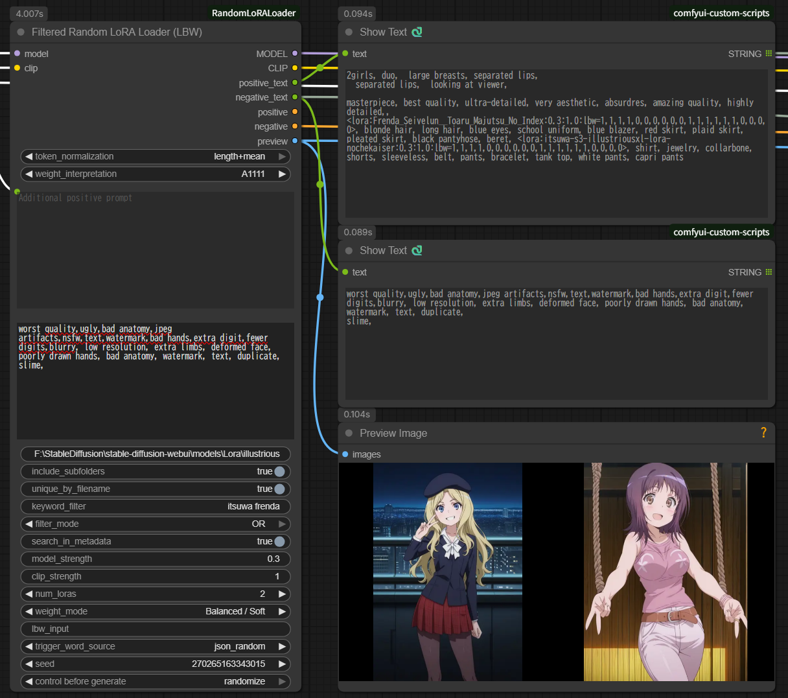

# Random LoRA Loader for ComfyUI

**[English README](./README.md) | 日本語版**

ComfyUIでLoRAをランダムに選択・適用するカスタムノードパッケージです。3つのノードを含みます:

1. **Random LoRA Loader** - 3フォルダから同時選択
2. **Filtered Random LoRA Loader** - 1フォルダ + キーワードフィルタ
3. **Filtered Random LoRA Loader (LBW)** - 🆕 LBW対応 + SD1.5/SDXL自動検出（v1.2.0新機能）




---

## ⚠️ 重要: 対応モデル

**本ノードはSD1.5とSDXLモデル専用です。**

- ✅ **対応:** Stable Diffusion 1.5、Stable Diffusion XL（SDXL）
- ❌ **非対応:** Flux、SD3、SDXL Turbo、Pony、その他のアーキテクチャ

LBWノードのブロックウェイト機能は、SD1.5/SDXLのU-Netアーキテクチャ専用に設計されています。他のモデルタイプではLBWが正常に動作しません。

---

## ノード概要

### Random LoRA Loader（オリジナル）

最大3つの異なるフォルダからLoRAを選択。フォルダベースの整理に最適。

**用途:**
- スタイル、キャラクター、コンセプトを別フォルダで管理
- 固定的なLoRAカテゴリ
- シンプルなフォルダベースのワークフロー

### Filtered Random LoRA Loader

1つのフォルダからキーワードフィルタで選択。動的な選択と大規模コレクションに最適。

**用途:**
- 全LoRAを1フォルダで管理、キーワードで絞り込み
- AND/OR条件での動的フィルタリング
- メタデータ検索機能
- 複数インスタンスの直列接続を推奨

### Filtered Random LoRA Loader (LBW) 🆕 v1.2.0新機能

LoRAブロックウェイト（LBW）対応の高度なノード。精密な効果コントロールが可能。

**用途:**
- 画風と構造の分離制御
- 精密なLoRA適用
- プロフェッショナルワークフロー
- 4つのプリセットモード + カスタム入力

**詳細は [README_LBW_ja.md](README_LBW_ja.md) を参照してください。**

---

## 主な機能

### 共通機能（全ノード）

- **マルチソースメタデータ読み取り**: 優先順位に従ってトリガーワードと作例プロンプトを自動取得
  1. `.metadata.json`形式（ComfyUI Lora Manager）- 優先度1
  2. `.info`形式（Civitai Helper）- 優先度2
  3. **LoRA本体ファイルの埋め込みメタデータ** - 優先度3
- **強度ランダム化**: 
  - **マイナス値対応の範囲指定**: `0.4-0.8`、`-0.8--0.3`（v1.2.0）
  - **範囲指定は0.1刻み**: 効果の違いを確認しやすい
  - **固定値は小数点2桁に丸め**: `0.847` → `0.85`
- **柔軟なトリガーワード取得**:
  - `json_combined`: 全トリガーワードパターンを結合（重複除去）
  - `json_random`: ランダムに1パターン選択
  - `json_sample_prompt`: 作例プロンプトをランダムに取得
  - `metadata`: 埋め込みメタデータから直接読み込み
- **作例プロンプト最適化**: LoRA構文を自動除去し、ノード設定の強度を適用
- **デュアルテキスト出力**: positive_textとnegative_textを分離出力
- **ComfyUI標準シード制御**: 固定/ランダム/増分/減分に対応
- **Wildcard Encode統合**: Wildcard Encode（Inspire）とシームレスに連携
- **LoRA構文自動除去**: additional_prompt内のLoRA構文を自動削除
- **プレビュー画像対応**: 選択されたLoRAのプレビュー画像/動画を表示（v1.1.0）
- **重複ファイル名処理**: サブフォルダ間の重複ファイル名を除外（v1.1.0）

### Filteredノード（Filtered & LBW）

- **キーワードフィルタリング**: スペース区切りキーワード、フレーズ対応
- **AND/ORモード**: 柔軟なフィルタリングロジック
- **メタデータ検索**: ファイル名または埋め込みメタデータから検索
- **高速キャッシング**: 初回読み込み後は即座にアクセス

### LBWノード限定 🆕

- **LoRAブロックウェイト対応**: 影響を受けるU-Netブロックを制御
- **SD1.5/SDXL自動検出**: 手動でモデルタイプを選択不要
- **4つのプリセットモード**:
  - Style Focused - OUTPUTブロックのみ
  - Character Focused - バランスの取れたIN+MID+OUT
  - Structure/Composition Only - INPUT+MIDブロックのみ
  - Balanced / Soft - 穏やかな適用
- **Preset: Randomモード**: 4つのプリセットからランダム選択
- **Direct Inputモード**: カスタムウェイト指定
- **ウェイト数自動調整**: 要素数の不一致を自動処理

---

## インストール

### ⚠️ オプション: 動画プレビュー対応

**動画ファイルプレビュー（.mp4, .webm, .avi, .mov）にはopencv-pythonが必須です:**

```bash
pip install opencv-python
```

**opencv-pythonなしの場合:**
- ✅ 静止画（.png, .jpg, .jpeg）は動作
- ✅ アニメ画像（.gif, .webp）は動作
- ❌ **動画ファイルは黒画面表示**（コンソールに警告メッセージ）

opencv-pythonの有無に関わらず、LoRA機能は正常に動作します。影響を受けるのはプレビュー表示のみです。

### 必要要件

- ComfyUI（標準インストールで動作）
- Python 3.9+
- **コア依存関係はComfyUIに含まれる** ✅

### インストール手順

```bash
cd ComfyUI/custom_nodes
git clone https://github.com/YOUR_USERNAME/RandomLoRALoader.git
# または手動でRandomLoRALoaderフォルダを作成してファイルをコピー
```

ComfyUIを再起動。

**注意:** コア機能にはPython標準ライブラリとComfyUIバンドルライブラリのみを使用。opencv-pythonは動画プレビューのみのオプション。

### アンインストール

```bash
# custom_nodesフォルダに移動
cd ComfyUI/custom_nodes

# RandomLoRALoaderフォルダを削除
rm -rf RandomLoRALoader

# Windowsの場合
rmdir /s RandomLoRALoader
```

またはRandomLoRALoaderフォルダを手動で削除してComfyUIを再起動。

---

## 使い方

### 基本的な使い方（Random LoRA Loader）

1. **ノード追加**: ノードブラウザで「Random LoRA Loader」を検索
2. **MODEL/CLIP接続**: ベースモデルとCLIPを入力に接続
3. **フォルダパス設定**: 
   - グループ1: スタイルLoRAフォルダパス
   - グループ2: キャラクターLoRAフォルダパス（オプション）
   - グループ3: コンセプトLoRAフォルダパス（オプション）
4. **各グループ設定**:
   - `num_loras`: 各グループから選択するLoRA数
   - `model_strength` / `clip_strength`: 適用強度（固定値または範囲指定）
5. **出力接続**:
   - `MODEL` / `CLIP`: KSamplerに接続
   - `positive` / `negative`: Set ConditioningまたはKSamplerに接続
   - `positive_text` / `negative_text`: Show Textに接続して確認（推奨）

### Wildcard Encode連携（推奨）

このノードはWildcard Encode（Inspire）とシームレスに連携し、動的プロンプト生成とランダムLoRA選択を組み合わせます。


#### 推奨接続方法

```
[Wildcard Encode (Inspire)]
  text: "__style__, {red|blue|green}, <lora:base_effect:0.5>"
  ↓
  ├─ populated_text ──→ [Random LoRA Loader]
  │                     additional_prompt_positive
  └─ MODEL/CLIP ──────→ model/clip入力
  
[Random LoRA Loader]
  フォルダ1: キャラクターLoRA
  フォルダ2: コンセプトLoRA
  ↓
  MODEL/CLIP/CONDITIONING → [KSampler]
```

#### 動作の仕組み

1. **Wildcard Encode処理**:
   - ワイルドカード展開: `__style__` → "anime style"
   - 選択肢展開: `{red|blue|green}` → "blue"
   - LoRA構文処理: `<lora:base_effect:0.5>` → MODELに適用
   - 結果: `populated_text` = "anime style, blue, <lora:base_effect:0.5>"

2. **Random LoRA Loader処理**:
   - **LoRA構文を自動除去**: `populated_text`から → "anime style, blue"
   - ランダムLoRA選択: character_alice, concept_magic
   - 最終プロンプト: "anime style, blue, alice, blonde hair, magic circle"
   - MODEL/CLIP: base_effect + character_alice + concept_magic（全て適用）

#### メリット

- ✅ ワイルドカード機能はWildcard Encodeに委任（専門ツール）
- ✅ ランダムLoRA選択はこのノードに委任（シンプル設定）
- ✅ プロンプト情報を完全に継承
- ✅ LoRA構文を自動クリーンアップ（ノイズなし）

### 3グループの例

```
グループ1: スタイルLoRA
  - num_loras_1: 2
  - model_strength_1: "0.6-0.9"  ← ランダム（0.1刻み）
  - clip_strength_1: "0.6-0.9"   ← ランダム（0.1刻み）

グループ2: キャラクターLoRA
  - num_loras_2: 1
  - model_strength_2: "1.0"      ← 固定
  - clip_strength_2: "1.0"       ← 固定

グループ3: 未使用
  - lora_folder_path_3: (空)
  - num_loras_3: 0

→ 結果: スタイルLoRA 2個（可変強度） + キャラクターLoRA 1個（固定強度） = 合計3個
```

---

## 設定

### 共通設定

| 設定項目 | 説明 | デフォルト |
|---------|------|-----------|
| `token_normalization` | トークン正規化方法 | `none` |
| `weight_interpretation` | プロンプト強調記法の解釈 | `A1111` |
| `additional_prompt_positive` | 追加ポジティブプロンプト（トリガーワードと結合） | (空) |
| `additional_prompt_negative` | 追加ネガティブプロンプト | (空) |
| `trigger_word_source` | トリガーワードソース | `json_combined` |
| `seed` | ランダム選択シード | `0` |

#### additional_promptに関する重要な注意

**対応:**
- 通常のプロンプトテキスト
- 他ノードからのテキスト入力（例: Wildcard Encodeの`populated_text`）

**非対応（自動除去）:**
- `<lora:xxx:0.8>` 形式のLoRA構文
- `{a|b|c}` 形式のワイルドカード構文
- `__filename__` 形式のワイルドカード構文

**理由:**
- このノードはフォルダ指定でLoRAを適用
- ワイルドカード機能は専用ノード（Wildcard Encodeなど）が処理すべき
- LoRA構文を書くと**ファイル名が意味のあるトークンとしてノイズになる**

**例（問題のあるケース）:**
```
入力: "1girl, <lora:anime_style:0.8>, beautiful"
↓
CLIPトークン化: [1girl, lora, anime, style, 0, 8, beautiful]
                        ^^^^^ ^^^^^
                        意図しない単語がプロンプトに追加 ❌
```

**正しい使い方:**
```
additional_prompt_positive: "1girl, beautiful"  ← LoRA構文なし ✅
LoRA適用: フォルダ指定機能を使用 ✅
```

または、Wildcard Encodeから接続する場合、LoRA構文は自動除去されます:
```
[Wildcard Encode] populated_text: "1girl, <lora:style:0.8>, beautiful"
       ↓
[このノード] additional_prompt_positive受信 → LoRA構文自動除去
       ↓
最終プロンプト: "1girl, beautiful" ✅
```

### グループ設定（1-3）

各グループを個別に設定可能:

| 設定項目 | 説明 | デフォルト |
|---------|------|-----------|
| `lora_folder_path_X` | LoRAフォルダの絶対パス | (空) |
| `include_subfolders_X` | サブフォルダを含める | `true` |
| `unique_by_filename_X` | 重複ファイル名を除外 | `true` |
| `model_strength_X` | MODEL適用強度 | `"1.0"` |
| `clip_strength_X` | CLIP適用強度 | `"1.0"` |
| `num_loras_X` | 選択するLoRA数 | グループ1: `1`、グループ2/3: `0` |

---

## 強度指定（重要）

強度フィールドは**固定値**または**範囲指定**を受け付けます。**マイナス値にも対応**しています。

### 固定値

```
入力: "1.0"
→ 常に1.0で適用

入力: "0.55"
→ 0.55に丸められる（小数点2桁）

入力: "-0.5"
→ マイナスLoRAとして-0.5で適用 ✅（v1.2.0）
```

### 範囲指定

**フォーマット:** `最小値-最大値`

```
入力: "0.6-0.9"
→ [0.6, 0.7, 0.8, 0.9] からランダム選択（0.1刻み）

入力: "-0.8--0.3"
→ [-0.8, -0.7, -0.6, -0.5, -0.4, -0.3] からランダム選択 ✅（v1.2.0）

入力: "-0.5-0.5"
→ [-0.5, -0.4, ..., 0.4, 0.5] からランダム選択 ✅
```

**v1.2.0の改善:**
- ✅ **マイナス範囲対応**: `-0.8--0.3` が正しく動作
- ✅ **全範囲で0.1刻み**: 効果の違いを確認しやすい
- ✅ **固定値は小数点2桁に丸め**: `0.847` → `0.85`

### 動作

**全ノード:**
- 範囲: 0.1刻みリスト → ランダム選択
- 固定: 小数点2桁に丸め

**例:**
```
model_strength_1: "0.6-0.9"
→ 各実行時に [0.6, 0.7, 0.8, 0.9] からランダム選択
→ コンソール: "[RandomLoRALoader] Selected strength: 0.7"
```

---

## MODEL強度 vs CLIP強度

### MODEL強度
- **影響範囲**: 画像そのもの（画風、構図、色、形）
- **効果**: 生成画像の視覚的特徴
- **例**: 
  - 高い値: 強い画風転送
  - 低い値: 微妙な画風ヒント

### CLIP強度
- **影響範囲**: プロンプト解釈（概念理解、言語-画像関連付け）
- **効果**: モデルがプロンプト指示にどれだけ従うか
- **例**:
  - 高い値: トリガーワードからの強いセマンティックガイダンス
  - 低い値: 弱いセマンティック影響

### 推奨設定

**ほとんどのユースケース:**
```
model_strength: 0.8
clip_strength: 0.8
→ バランスの取れた適用
```

**微妙な画風適用:**
```
model_strength: 0.4-0.6
clip_strength: 0.8-1.0
→ 軽い視覚効果、強いセマンティックガイダンス
```

**強い画風上書き:**
```
model_strength: 1.0-1.2
clip_strength: 0.6-0.8
→ 強い視覚効果、中程度のセマンティックガイダンス
```

---

## トリガーワード取得方法

### json_combined（デフォルト）

JSONメタデータから全トリガーワードパターンを結合。

**ソース:**
1. `activation text`フィールド
2. `ss_tag_frequency`キー（上位3つ）
3. `modelspec.description`キーワード
4. `ss_output_name`キーワード

**例:**
```json
{
  "activation text": "anime style, detailed eyes",
  "ss_tag_frequency": {
    "1girl": 500,
    "blue eyes": 300,
    "long hair": 250
  }
}
```
**結果:** `"anime style, detailed eyes, 1girl, blue eyes, long hair"`

---

### json_random

1つのトリガーワードパターンをランダムに選択。

**例:**
```
候補:
- "anime style, detailed eyes"
- "1girl, blue eyes, long hair"
- "anime, girl, portrait"

ランダム選択: "1girl, blue eyes, long hair"
```

---

### json_sample_prompt

JSONメタデータから作例プロンプトを取得。

**ソースフィールド（優先順位順）:**
1. `sample_prompts`
2. `civitai.images[0].meta.prompt`

**処理:**
- LoRA構文（`<lora:xxx:0.8>`）を自動除去
- ノード設定の強度に置き換え
- ネガティブプロンプトも抽出（可能な場合）

**例:**
```json
{
  "sample_prompts": "1girl, <lora:style:0.9>, beautiful, detailed eyes"
}
```
**結果:** `"1girl, beautiful, detailed eyes"`（LoRA構文除去）

---

### metadata

埋め込みLoRAファイルメタデータから直接トリガーワードを読み込み。

**ソース:**
- Safetensorsメタデータキー
- json_combinedと同様だがLoRAファイルから直接読み込み

**使用時:**
- 外部JSONファイルがない場合
- オリジナルのトレーニングメタデータを使用したい場合

---

## 出力

全ノードは以下の出力を提供:

| 出力 | タイプ | 説明 |
|------|------|------|
| `MODEL` | MODEL | LoRA適用済みモデル |
| `CLIP` | CLIP | LoRA適用済みCLIP |
| `positive` | CONDITIONING | ポジティブコンディショニング（LoRA構文除去） |
| `negative` | CONDITIONING | ネガティブコンディショニング |
| `positive_text` | STRING | LoRA構文付き完全ポジティブプロンプトテキスト |
| `negative_text` | STRING | 完全ネガティブプロンプトテキスト |
| `preview` | IMAGE | 選択されたLoRAのプレビュー画像バッチ（v1.1.0） |

### テキスト出力形式

**positive_text例:**
```
<lora:style_anime:0.8:0.8>, <lora:character_alice:1.0:1.0>, anime style, alice, blonde hair, 1girl, beautiful
```

**LBWノードのpositive_text例:**
```
<lora:style_anime:0.8:0.8:lbw=1,0,0,0,0,0,0,0,0,0,0,1,1,1,1,1,1,1,1,1>, anime style, 1girl, beautiful
```

**positive（CONDITIONING）内容:**
```
anime style, alice, blonde hair, 1girl, beautiful
（クリーンなプロンプトのためLoRA構文除去）
```

### プレビュー画像（v1.1.0）

**対応形式（優先順位順）:**
1. 静止画（.png, .jpg, .jpeg） - 常に動作
2. アニメ画像（.gif, .webp） - 1フレーム目、常に動作
3. 動画ファイル（.mp4, .webm, .avi, .mov） - 1フレーム目、opencv-python必要

**ファイルマッチング:**
- LoRAファイル名で始まるファイル（大文字小文字無視）
- 例: `style_anime.safetensors` にマッチ:
  - `style_anime.png` ✅
  - `style_anime_preview.jpg` ✅
  - `STYLE_ANIME.PNG` ✅

---

## Filtered Random LoRA Loader

**キーワードフィルタリング付き単一フォルダ対応。**


### 主な機能

- **キーワードフィルタリング**: スペース区切りキーワードでLoRAを絞り込み
- **AND/ORモード**: 柔軟なフィルタリングロジック
- **フレーズマッチング**: 引用符で完全一致フレーズ
- **メタデータ検索**: ファイル名または埋め込みメタデータから検索
- **高速キャッシング**: 初回検索後は即座にアクセス
- **直列接続対応**: 複雑なワークフロー向けに複数インスタンスを連結

### パラメータ

| パラメータ | 説明 | デフォルト |
|-----------|------|-----------|
| `lora_folder_path` | LoRAフォルダパス | (空) |
| `keyword_filter` | スペース区切りキーワードまたは引用符フレーズ | (空) |
| `filter_mode` | `AND` / `OR` | `AND` |
| `search_in_metadata` | JSON/埋め込みメタデータから検索 | `false` |
| `num_loras` | 選択するLoRA数 | `1` |
| `model_strength` | MODEL強度（固定または範囲） | `"1.0"` |
| `clip_strength` | CLIP強度（固定または範囲） | `"1.0"` |
| `include_subfolders` | サブフォルダを含める | `true` |
| `unique_by_filename` | 重複ファイル名を除外 | `true` |

### キーワードフィルタ構文

**基本キーワード（ANDモード）:**
```
keyword_filter: "anime girl"
→ "anime"と"girl"の両方を含むファイルにマッチ
```

**ORモード:**
```
filter_mode: OR
keyword_filter: "anime realistic"
→ "anime"または"realistic"を含むファイルにマッチ
```

**フレーズマッチング:**
```
keyword_filter: '"anime style" detailed'
→ 完全一致フレーズ"anime style"と単語"detailed"を含む必要
```

**複数フレーズ:**
```
keyword_filter: '"anime style" "detailed eyes" red'
→ "anime style"と"detailed eyes"と"red"を含む必要
```

### メタデータ検索

**ファイル名検索（デフォルト）:**
```
search_in_metadata: false
→ 高速、ファイル名のみ検索
```

**メタデータ検索:**
```
search_in_metadata: true
→ 低速、JSON/埋め込みメタデータを検索
→ 初回検索後はキャッシュ（2回目以降は即座）
```

**パフォーマンス:**
- 初回読み込み（SSD）:
  - 1,000ファイル: 約2秒
  - 5,000ファイル: 約10秒
  - 10,000ファイル: 約20秒
- 2回目以降: 即座（<100ms）
- メモリ: 10,000ファイルあたり約150MB

### 使用例

#### 例1: キャラクター選択

```
lora_folder_path: "/path/to/all_loras"
keyword_filter: "character girl"
filter_mode: AND
num_loras: 1
```

**結果:** "character"と"girl"の両方を含むキャラクターLoRAを1つ選択

---

#### 例2: 複数インスタンス（推奨）


```
[Load Checkpoint]
  ↓
[Filtered Random LoRA Loader #1]
  keyword_filter: "style anime"
  num_loras: 1
  ↓
[Filtered Random LoRA Loader #2]
  keyword_filter: "character"
  num_loras: 1
  ↓
[KSampler]
```

**メリット:**
- カテゴリごとに異なるフィルタリング
- 独立した強度設定
- より柔軟性が高い

---

#### 例3: メタデータ検索

```
search_in_metadata: true
keyword_filter: "detailed eyes"
```

**検索対象:**
- ファイル名
- JSON `activation text`
- JSON `ss_tag_frequency`
- JSON `modelspec.description`
- 埋め込みLoRAメタデータ

---

## Filtered Random LoRA Loader (LBW) 🆕 v1.2.0新機能

**LoRAブロックウェイト対応の高度なノード。**


### LBWとは？

LoRAブロックウェイトにより、U-Netのどの部分がLoRAの影響を受けるかを制御できます:

```
INPUTブロック  → 構造、構図、レイアウト
   ↓
MIDDLEブロック → 全体的な特徴
   ↓
OUTPUTブロック → 画風、ディテール、微調整
```

### 主な機能

- **4つのプリセットモード**:
  - **Style Focused**: OUTPUTブロックのみ（構造を変えずに画風のみ）
  - **Character Focused**: バランスの取れたIN+MID+OUT（キャラクター特徴）
  - **Structure/Composition Only**: INPUT+MIDブロック（画風を変えずにレイアウトのみ）
  - **Balanced / Soft**: 穏やかな適用（自然な結果）
- **Preset: Random**: 4つのプリセットから毎回ランダム選択
- **Direct Input**: カスタムウェイト指定
- **SD1.5/SDXL自動検出**: 手動でモデルタイプを選択不要
- **ウェイト数自動調整**: 要素数の不一致を自動処理

### パラメータ

Filtered Random LoRA Loaderと同じ、加えて:

| パラメータ | 説明 | デフォルト |
|-----------|------|-----------|
| `weight_mode` | LBWプリセットまたはDirect Input | `Normal (All 1.0)` |
| `lbw_input` | カスタムウェイト（Direct Input用） | (空) |

### ウェイトモード

#### Normal (All 1.0)
ブロックウェイトなしの標準LoRA適用。

#### Style Focused
```
SDXL: 1,0,0,0,0,0,0,0,0,0,0,1,1,1,1,1,1,1,1,1
SD1.5: 1,0,0,0,0,0,0,1,1,1,1,1,1,1,1,1,1
```
- OUTPUTブロックのみ
- 構造を変えずに画風のみ
- 用途: 画風LoRA、エフェクトLoRA

#### Character Focused
```
SDXL: 1,1,1,1,0,0,0,0,0,0,1,1,1,1,1,1,1,1,1,1
SD1.5: 1,0,0,0,0,0,0,0,1,1,1,1,1,1,1,1,1
```
- バランスの取れたIN+MID+OUT
- キャラクター特徴を保持
- 用途: キャラクターLoRA、人物LoRA

#### Structure/Composition Only
```
SDXL: 1,1,1,1,1,1,1,1,1,1,1,0,0,0,0,0,0,0,0,0
SD1.5: 1,1,1,1,1,1,1,1,0,0,0,0,0,0,0,0,0
```
- INPUT+MIDブロックのみ
- 画風を変えずに構造のみ
- 用途: ポーズLoRA、構図LoRA

#### Balanced / Soft
```
SDXL: 1,1,1,1,0,0,0,0,0,0,1,1,1,1,1,1,0,0,0,0
SD1.5: 1,1,1,1,0,0,0,1,1,1,1,1,0,0,0,0,0
```
- 穏やかな適用
- 自然な結果
- 用途: 汎用LoRA、マルチLoRAワークフロー

#### Preset: Random
上記4つのプリセットから毎回ランダムに1つ選択。

#### Direct Input
```
weight_mode: Direct Input
lbw_input: "1,0.5,0.5,0,0,0,0,0,0,0,1,0.8,0.8,0.8,0.8,0.8,0.5,0.5,0.5,0.5"
```
- カスタムウェイト指定
- SDXL: 20要素、SD1.5: 17要素
- 要素数が合わない場合は自動調整

### 使用例

#### 例1: 画風のみ

```
[Filtered Random LoRA Loader (LBW)]
  keyword_filter: "anime watercolor"
  weight_mode: Style Focused
  ↓
[KSampler]
```

**結果:** 構図を変えずにアニメ水彩画風を適用

---

#### 例2: 構造 → 画風

```
[Load Checkpoint]
  ↓
[Filtered Random LoRA Loader (LBW)]
  keyword_filter: "pose"
  weight_mode: Structure/Composition Only
  ↓
[Filtered Random LoRA Loader (LBW)]
  keyword_filter: "oil painting"
  weight_mode: Style Focused
  ↓
[KSampler]
```

**結果:** ポーズ調整 → 油絵風適用

---

#### 例3: カスタムウェイト

```
weight_mode: Direct Input
lbw_input: "1,0.5,0.5,0.5,0,0,0,0,0,0,1,1,1,1,1,1,0.5,0.5,0.5,0.5"
```

**結果:** カスタムブロックウェイト分布

---

### 上級者向け: カスタムプリセット

ソースファイルで直接プリセットを編集できます:

**ファイル:** `filtered_random_lora_loader_lbw.py`（29～41行目）

詳細なカスタマイズガイドは [README_LBW_ja.md](README_LBW_ja.md) を参照してください。

---

## Tips & Tricks

### 複数効果の直列接続

ノードを直列接続して異なるLoRAカテゴリを適用:

```
[Load Checkpoint]
  ↓
[Filtered Random LoRA Loader (LBW)] (Structure/Composition Only)
  keyword_filter: "pose"
  ↓
[Filtered Random LoRA Loader (LBW)] (Style Focused)
  keyword_filter: "watercolor"
  ↓
[KSampler]
```

**メリット:**
- カテゴリごとに異なる設定
- 累積的なLoRA効果
- 最終結果のより細かい制御

---

### バリエーションのための強度ランダム化

固定値の代わりに範囲を使用:

```
model_strength_1: "0.6-0.9"
clip_strength_1: "0.6-0.9"
```

**効果:**
- 各生成で異なる強度を使用
- 結果にバリエーション
- 最適な強度を見つけやすい

---

### キーワードフィルタリングのベストプラクティス

**具体的なキーワードを使用:**
```
✅ 良い: "anime girl"
❌ 広すぎる: "anime"
```

**メタデータ検索と組み合わせ:**
```
search_in_metadata: true
keyword_filter: "detailed eyes"
```

**精密性のためフレーズを使用:**
```
keyword_filter: '"anime style" detailed'
→ 完全一致フレーズ"anime style"と単語"detailed"を含む必要
```

---

### Wildcard Encode + Random LoRA Loader

**究極の動的ワークフロー:**

```
[Wildcard Encode (Inspire)]
  text: "__style__, __pose__, {red|blue|green}"
  ↓
  populated_text ──→ [Random LoRA Loader]
                     additional_prompt_positive
  ↓
[KSampler]
```

**結果:**
- プロンプトのワイルドカード展開
- バリエーションのためのランダムLoRA選択
- LoRA構文なしのクリーンなプロンプト
- 最大の柔軟性

---

### 整理のためのプレビュー画像

プレビュー表示を有効化して:
- どのLoRAが選択されたか確認
- 生成前にLoRAの外観を検証
- LoRAコレクションを視覚的に整理

**推奨ワークフロー:**
```
[Random LoRA Loader]
  preview ──→ [Preview Image]（検証用）
  MODEL ──→ [KSampler]
```

---

## トラブルシューティング

### LoRAが見つからない

**確認事項:**
1. LoRAフォルダパスが正しい（絶対パス）
2. フォルダに`.safetensors`ファイルが存在
3. LoRAがサブフォルダにある場合は`include_subfolders`設定
4. コンソールでエラーメッセージを確認

**有効なパスの例:**
```
Windows: C:/ComfyUI/models/loras/style
Linux/Mac: /home/user/ComfyUI/models/loras/style
```

---

### トリガーワードが見つからない

**確認事項:**
1. メタデータファイル（`.metadata.json`または`.info`）が存在
2. JSONファイルに必要なフィールドが含まれている:
   - `activation text`
   - `ss_tag_frequency`
   - `sample_prompts`
   - `civitai.trainedWords`または`civitai.images`
3. 異なる`trigger_word_source`設定を試す

**JSON形式を確認:**
```json
{
  "activation text": "anime style, detailed",
  "ss_tag_frequency": {...},
  "modelspec.description": "...",
  "sample_prompts": "..."
}
```

---

### LoRAが適用されない

**確認事項:**
1. `num_loras`が0でない
2. 強度値が全て0でない
3. MODEL/CLIP出力が正しく接続されている
4. コンソールでLoRA適用メッセージを確認
5. LBWノードの場合: weight_modeが"Normal (All 1.0)"で全ウェイトが0でない

---

### プレビュー画像が表示されない

**確認事項:**
1. プレビューファイルがLoRAファイル名とマッチ
2. 動画ファイルの場合: opencv-pythonがインストール済み（`pip install opencv-python`）
3. 対応形式: .png, .jpg, .jpeg, .gif, .webp, .mp4, .webm, .avi, .mov
4. ファイルパーミッションが正しい

**opencv-pythonなし:**
- 静止画は動作 ✅
- アニメ画像は動作 ✅
- 動画ファイルは黒画面 ⚠️

---

### マイナス値で強度が動作しない（v1.2.0で修正）

**以前の問題（v1.1.0）:**
```
入力: "-0.5"
結果: 1.0 ❌（デフォルトに変換）
```

**v1.2.0で修正:**
```
入力: "-0.5"
結果: -0.5 ✅（マイナスLoRAが正しく適用）

入力: "-0.8--0.3"
結果: [-0.8, -0.7, -0.6, -0.5, -0.4, -0.3] からランダム ✅
```

---

### Wildcard Encodeの問題

**ワイルドカードテキストが出力に表示される場合:**

1. **接続を確認**: Wildcard Encodeの`populated_text`を`additional_prompt_positive`に接続
2. **間違った出力**: `text`（入力）をこのノードに接続しない
3. **LoRA構文が表示される**: このノードが自動的に除去

**ワークフロー例:**
```
[Wildcard Encode (Inspire)]
  populated_text ──→ [Random LoRA Loader]
  ("text"ではない)  additional_prompt_positive
```

---

### 重複LoRAが選択される

**解決策:** `unique_by_filename`を有効化

```
unique_by_filename_1: true
```

異なるサブフォルダから同じLoRAを選択するのを防ぎます:
```
/style/lora.safetensors
/backup/lora.safetensors
→ 1つだけ選択 ✅
```

---

## 詳細ドキュメント

- **[README_LBW_ja.md](README_LBW_ja.md)** - LBW完全ガイド（日本語）
- **[README_LBW.md](README_LBW.md)** - LBW complete documentation (English)
- **[README.md](README.md)** - English main documentation

---

## 免責事項とサポートポリシー

### 免責事項

- このノードは**技術サポートなし**で提供されます
- 機能の保証はありません
- 将来のComfyUIアップデートとの互換性は保証されません
- バグレポートや機能リクエストに対応しない場合があります
- 自己責任で使用してください

### サポート状況

- ❌ issueやメールでの個別サポートなし
- ❌ バグ修正や機能追加の保証なし
- ✅ コードはオープンソース - 自由にフォーク・修正可能
- ✅ コミュニティディスカッション歓迎（返答の約束なし）

### 問題の報告

サポートは保証されませんが、以下が可能です:
1. リポジトリの既存issueを確認
2. このREADMEとトラブルシューティングセクションを確認
3. issueを開く（対応されない場合があります）
4. 自分でフォークして修正

---

## ライセンス

MIT License

---

## 更新履歴

### v1.2.0（2026-01-13）

#### 追加
- ✅ **新ノード**: Filtered Random LoRA Loader (LBW)
- ✅ 4つのプリセット付きLoRAブロックウェイト（LBW）対応
- ✅ LBW用SD1.5/SDXL自動検出
- ✅ LBW用Preset: Randomモード
- ✅ カスタムLBWウェイト用Direct Inputモード
- ✅ LBW用ウェイト数自動調整
- ✅ **強度のマイナス値対応**: `-0.5`、`-0.8--0.3`が正しく動作
- ✅ **動画プレビュー対応**: .mp4, .webm, .avi, .mov（opencv-python必要）
- ✅ **強度精度の改善**:
  - 範囲指定: 全ノードで0.1刻み
  - 固定値: 小数点2桁に丸め

#### 修正
- ✅ **重大バグ**: マイナス単一値（`"-0.5"`）が正しく動作（以前は1.0に変換）
- ✅ **重大バグ**: マイナス範囲（`"-0.8--0.3"`）が正しく動作（以前はエラー）
- ✅ 正規表現パターンマッチングで強度パースを改善

#### 変更
- ✅ 全3ノードで強度動作を統一
- ✅ ノード名変更: "Filtered Random LoRA Loader (Advanced)" → "Filtered Random LoRA Loader (LBW)"
- ✅ モデル互換性警告を強調したドキュメント強化

### v1.1.0（2026-01-04）

#### 追加
- ✅ **新ノード**: Filtered Random LoRA Loader
- ✅ AND/ORモード付きキーワードフィルタリング
- ✅ キャッシング付きメタデータ検索
- ✅ プレビュー画像出力（IMAGEタイプ）
- ✅ 重複ファイル名処理（`unique_by_filename`）
- ✅ アニメ画像対応（.gif, .webp）

#### 変更
- ✅ **破壊的変更**: `additional_prompt`を`additional_prompt_positive`と`additional_prompt_negative`に分割
- ✅ 強度精度を小数点1桁に統一
- ✅ LoRA構文除去を改善

#### 修正
- ✅ `json_sample_prompt`モードでnegative_text出力を修正
- ✅ メタデータトリガーワードにLoRA構文が表示される問題を修正
- ✅ INPUT_TYPESの重複パラメータを修正

### v1.0.0（2025-12-30）

#### 追加
- ✅ 初回リリース
- ✅ 3グループ対応のRandom LoRA Loader
- ✅ マルチソースメタデータ読み取り
- ✅ 範囲指定付き強度ランダム化
- ✅ トリガーワード抽出
- ✅ Wildcard Encode互換性
- ✅ クリーンプロンプト付きCONDITIONING出力

---

## 参考文献

- [ComfyUI](https://github.com/comfyanonymous/ComfyUI)
- [Wildcard Encode (Inspire)](https://github.com/ltdrdata/ComfyUI-Inspire-Pack)
- [LoRA Block Weight理論](https://github.com/hako-mikan/sd-webui-lora-block-weight)

---

**精密な制御で柔軟なLoRAランダム化をお楽しみください！🎲✨**
