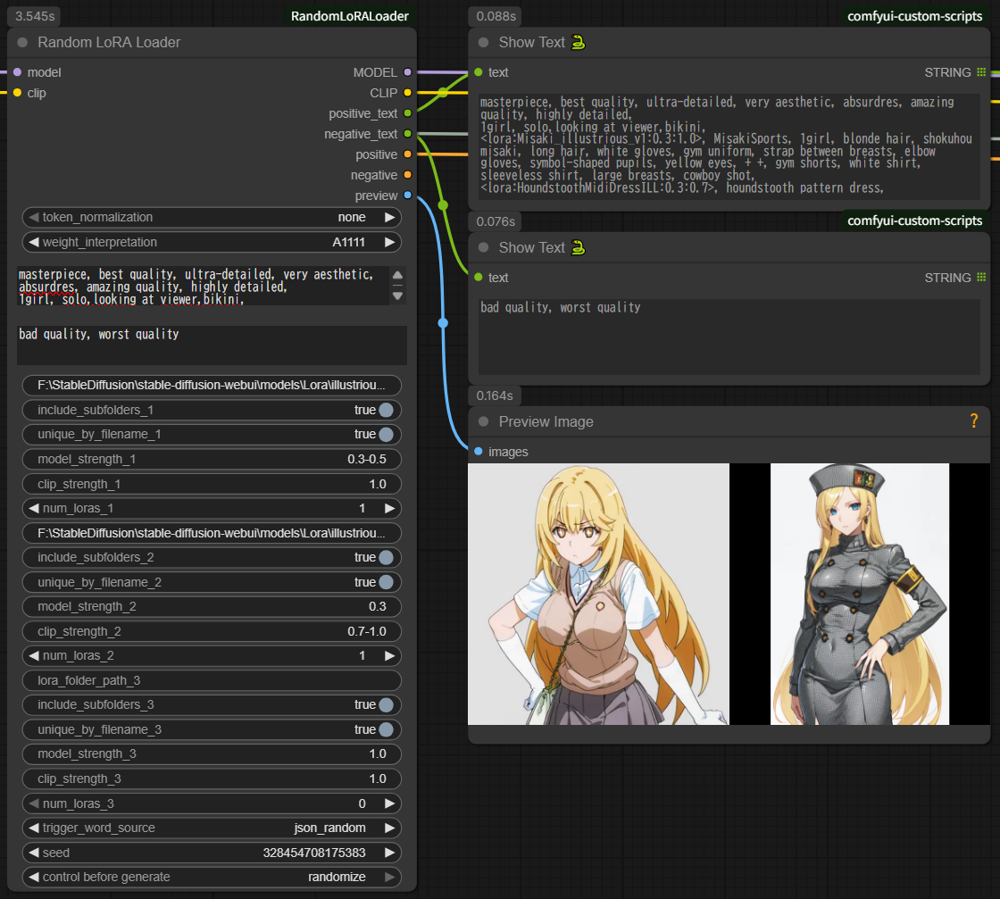
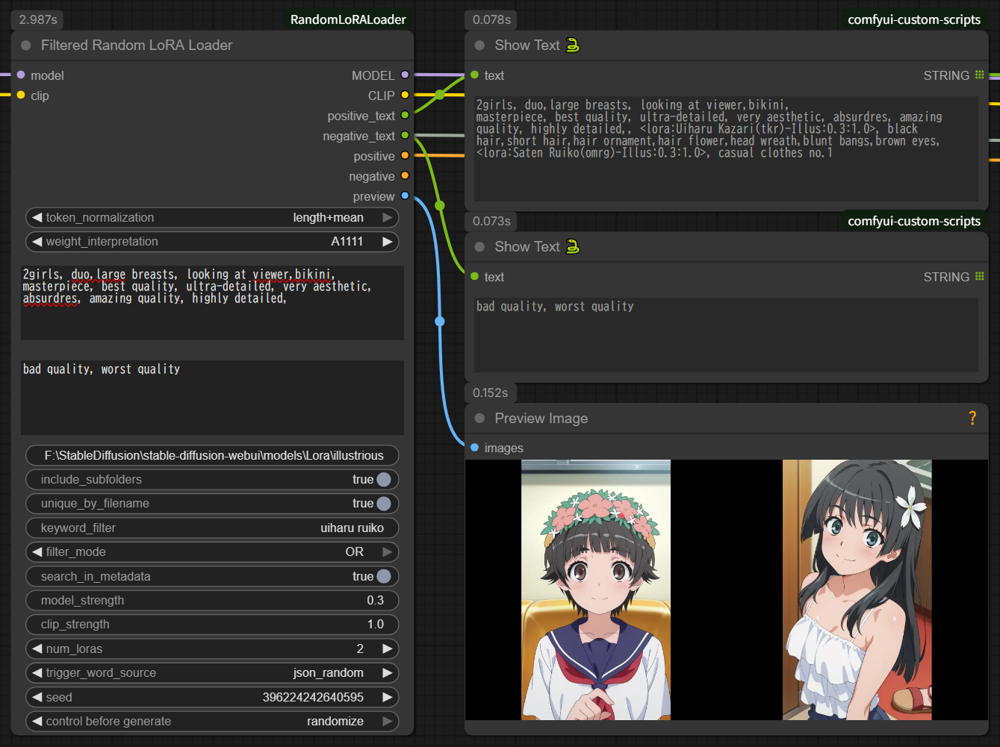
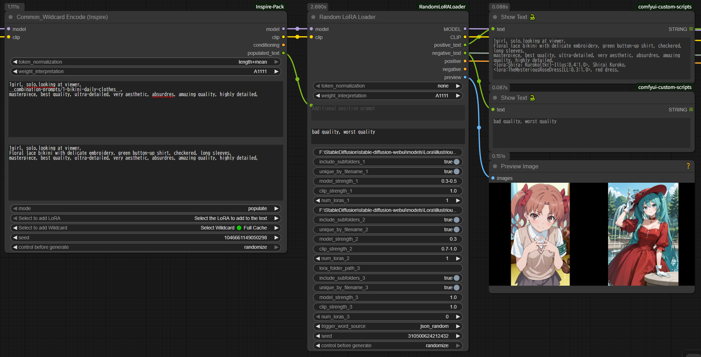
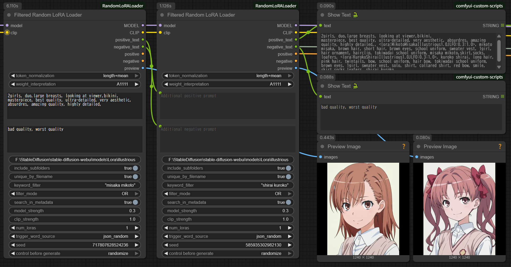
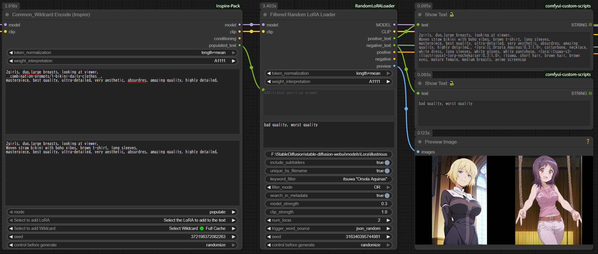

# Random LoRA Loader for ComfyUI

**[English README](./README.md) | 日本語版**

ComfyUIでLoRAをランダムに選択・適用するカスタムノードパッケージです。2つのノードを含みます:

1. **Random LoRA Loader** - 3フォルダから同時選択
2. **Filtered Random LoRA Loader** - 1フォルダ + キーワードフィルタ（新機能 v1.1.0）



---

## ノード概要

### Random LoRA Loader（オリジナル）

最大3つの異なるフォルダからLoRAを選択。フォルダベースの整理に最適。

**用途:**
- スタイル、キャラクター、コンセプトを別フォルダで管理
- 固定的なLoRAカテゴリ
- シンプルなフォルダベースのワークフロー

### Filtered Random LoRA Loader（新機能）

1つのフォルダからキーワードフィルタで選択。動的な選択と大規模コレクションに最適。

**用途:**
- 全LoRAを1フォルダで管理、キーワードで絞り込み
- AND/OR条件での動的フィルタリング
- メタデータ検索機能
- 複数インスタンスの直列接続を推奨

---

## 主な機能（両ノード共通）

- **3グループ対応**: 最大3つの異なるフォルダからLoRAを選択可能
- **マルチソースメタデータ読み取り**: 優先順位に従ってトリガーワードと作例プロンプトを自動取得
  1. `.metadata.json`形式（ComfyUI Lora Manager）- 優先度1
  2. `.info`形式（Civitai Helper）- 優先度2
  3. **LoRA本体ファイルの埋め込みメタデータ** - 優先度3（新機能）
- **強度ランダム化**: 範囲指定で強度をランダムに変化（例: `0.4-0.8`）
- **柔軟なトリガーワード取得**:
  - `json_combined`: 全トリガーワードパターンを結合（重複除去）
  - `json_random`: ランダムに1パターン選択
  - `json_sample_prompt`: 作例プロンプトをランダムに取得
  - **`metadata`**: 埋め込みメタデータから直接読み込み（新機能）
- **作例プロンプトの最適化**: 作例内のLoRA記述を自動削除し、ノード設定の強度を適用
- **2つのテキスト出力**: positive_textとnegative_textを個別に出力
- **ComfyUI標準のseed制御**: fixed/randomize/increment/decrementに対応

## インストール

### 必要な環境

- ComfyUI（動作確認済み環境があれば、そのまま使えます）
- **追加ライブラリのインストール: 不要** ✅

### 手順

```bash
cd ComfyUI/custom_nodes
git clone https://github.com/your-repo/RandomLoRALoader.git
# または
# 手動でRandomLoRALoaderフォルダを作成し、ファイルをコピー
```

ComfyUIを再起動してください。

**注意:** Python標準ライブラリとComfyUI付属ライブラリのみ使用しているため、`pip install`などの追加インストールは一切不要です。

## 使い方

### 基本的な使用方法

1. **ノードを配置**: ノードブラウザから「Random LoRA Loader」を検索して配置
2. **MODEL/CLIPを接続**: ベースモデルとCLIPを入力に接続
3. **フォルダパスを設定**: 
   - グループ1: スタイル用LoRAフォルダのパス
   - グループ2: キャラクター用LoRAフォルダのパス（オプション）
   - グループ3: コンセプト用LoRAフォルダのパス（オプション）
4. **各グループの設定**:
   - `num_loras`: 各グループから選択するLoRA個数
   - `model_strength` / `clip_strength`: 適用強度（固定値またはランダム範囲）
5. **出力を接続**:
   - `MODEL` / `CLIP`: KSamplerなどに接続
   - `positive` / `negative`: Set ConditioningまたはKSamplerに接続
   - `positive_text` / `negative_text`: Show Textノードで確認（推奨）

### Wildcard Encode (Inspire)との連携（推奨ワークフロー）

このノードはWildcard Encode (Inspire)と組み合わせることで、wildcardによる動的プロンプト生成とランダムLoRA選択の両方を実現できます。



#### 推奨接続例

```
[Wildcard Encode (Inspire)]
  text: "__style__, {red|blue|green}, <lora:base_effect:0.5>"
  ↓
  ├─ populated_text ──→ [Random LoRA Loader]
  │                     additional_prompt
  └─ MODEL/CLIP ──────→ model/clip入力
  
[Random LoRA Loader]
  フォルダ1: character用LoRA
  フォルダ2: concept用LoRA
  ↓
  MODEL/CLIP/CONDITIONING → [KSampler]
```

#### 動作の流れ

1. **Wildcard Encodeの処理**:
   - wildcard展開: `__style__` → "anime style"
   - 選択肢展開: `{red|blue|green}` → "blue"
   - LoRA構文処理: `<lora:base_effect:0.5>` → MODELに適用
   - 結果: `populated_text` = "anime style, blue, <lora:base_effect:0.5>"

2. **Random LoRA Loaderの処理**:
   - `populated_text`から**LoRA構文を自動削除**: "anime style, blue"
   - ランダムLoRA選択: character_alice, concept_magic
   - 最終プロンプト: "anime style, blue, alice, blonde hair, magic circle"
   - MODEL/CLIP: base_effect + character_alice + concept_magic（全て適用済み）

#### メリット

- ✅ wildcard機能をWildcard Encodeに任せる（専門ツールの利用）
- ✅ ランダムLoRA選択をこのノードに任せる（シンプルな設定）
- ✅ プロンプト情報が完全に引き継がれる
- ✅ LoRA構文が自動クリーンアップされる（ノイズなし）

### 3グループの活用例

```
グループ1: style用LoRAフォルダ
  - num_loras_1: 2
  - model_strength_1: "0.6-0.9"  ← ランダム
  - clip_strength_1: "0.6-0.9"   ← ランダム

グループ2: character用LoRAフォルダ
  - num_loras_2: 1
  - model_strength_2: "1.0"      ← 固定
  - clip_strength_2: "1.0"       ← 固定

グループ3: 未使用
  - lora_folder_path_3: (空)
  - num_loras_3: 0

→ 結果: style 2個（可変強度）+ character 1個（固定強度）= 合計3個のLoRAが適用
```

## 設定項目

### 共通設定

| 項目 | 説明 | デフォルト |
|------|------|------------|
| `token_normalization` | トークン正規化方式 | `none` |
| `weight_interpretation` | プロンプト強調記法の解釈方式 | `A1111` |
| `additional_prompt` | 追加プロンプト（全LoRAのトリガーワードと結合） | (空) |
| `trigger_word_source` | トリガーワード取得元 | `json_combined` |
| `seed` | ランダム選択のシード値 | `0` |

#### additional_promptに関する重要な注意事項

`additional_prompt`欄の動作仕様：

**✅ 対応している:**
- 通常のプロンプトテキスト
- 他ノードからのテキスト入力接続（例: Wildcard Encodeの`populated_text`）

**❌ 対応していない（自動削除されます）:**
- `<lora:xxx:0.8>` 形式のLoRA構文
- `{a|b|c}` 形式のwildcard構文
- `__filename__` 形式のwildcard構文

**理由:**
- このノードはフォルダ指定によるLoRA適用を行います
- wildcard機能は専用ノード（Wildcard Encode等）に任せる設計です
- LoRA構文を記述しても解釈されず、**ファイル名が意味のあるトークンとしてノイズになります**

**例（問題のあるケース）:**
```
入力: "1girl, <lora:anime_style:0.8>, beautiful"
↓
CLIPのトークン化: [1girl, lora, anime, style, 0, 8, beautiful]
                            ^^^^^ ^^^^^
                            意図しない単語がプロンプトに追加される ❌
```

**正しい使い方:**
```
additional_prompt: "1girl, beautiful"  ← LoRA構文なし ✅
LoRA適用: フォルダ指定機能を使用 ✅
```

または、Wildcard Encodeからの接続時は自動的にLoRA構文が削除されます：
```
[Wildcard Encode] populated_text: "1girl, <lora:style:0.8>, beautiful"
       ↓
[このノード] additional_prompt受信 → LoRA構文自動削除
       ↓
最終プロンプト: "1girl, beautiful" ✅
```

### グループ設定（1〜3）

各グループで以下の項目を個別に設定可能：

| 項目 | 説明 | デフォルト |
|------|------|------------|
| `lora_folder_path_X` | LoRAフォルダの絶対パス | (空) |
| `include_subfolders_X` | サブフォルダを含めるか | `true` |
| `model_strength_X` | MODELへの適用強度 | `"1.0"` |
| `clip_strength_X` | CLIPへの適用強度 | `"1.0"` |
| `num_loras_X` | 選択するLoRA個数 | グループ1: `1`, グループ2/3: `0` |

## 強度の指定方法（重要）

強度欄には**固定値**または**ランダム範囲**を指定できます。

### 固定値の場合

```
入力: "1.0"
→ 常に 1.0 で適用

入力: "0.55"
→ 常に 0.55 で適用

入力: "0.8"
→ 常に 0.8 で適用
```

**特徴:**
- 入力した数値がそのまま使用されます
- 小数第2位まで指定可能（例: `0.55`）

### ランダム範囲の場合

```
入力: "0.4-0.8"
→ 0.4, 0.5, 0.6, 0.7, 0.8 からランダムに選択（0.1刻み）

入力: "0.5-1.0"
→ 0.5, 0.6, 0.7, 0.8, 0.9, 1.0 からランダムに選択

入力: "0.44-0.82"
→ 0.4, 0.5, 0.6, 0.7, 0.8 からランダムに選択
   （範囲は自動的に小数第1位に丸められます）
```

**特徴:**
- ハイフン（`-`）で範囲を指定
- 0.1刻みで値が生成されます
- 範囲の上限・下限が小数第2位以下の場合、小数第1位に丸められます
- 毎回実行するたびに異なる値が選ばれます

### エラー処理

```
入力: "abc" または不正な形式
→ エラーログが出力され、強度 1.0 で処理されます
```

**エラーメッセージ例:**
```
[RandomLoRALoader] ❌ 強度 'abc' を解析できません、1.0を使用
[RandomLoRALoader] 💡 使用例: '1.0' または '0.4-0.8'
```

### 実際の強度確認

実際に使用された強度は `positive_text` 出力で確認できます：

```
<lora:style_anime:0.7:0.6>, anime style, vibrant,
               ↑   ↑
          MODEL強度 CLIP強度
```

**推奨:** Show Textノードを `positive_text` に接続して、実際の強度を確認してください。

## トリガーワード取得方式

### json_combined（全結合）

全トリガーワードパターンを結合し、重複を除去します。

**例:**
```json
"trainedWords": [
  "character, red hair, blue eyes, uniform",
  "character, red hair, blue eyes, casual clothes"
]
```
↓
```
出力: character, red hair, blue eyes, uniform, casual clothes
```

### json_random（ランダム選択）

トリガーワードパターンからランダムに1つを選択します。

**例:**
```json
"trainedWords": [
  "character, red hair, blue eyes, uniform",
  "character, red hair, blue eyes, casual clothes"
]
```
↓
```
出力: character, red hair, blue eyes, casual clothes (ランダム)
```

### json_sample_prompt（作例取得）

JSONの作例プロンプトからランダムに1つ取得します。

- positive_textとnegative_textの両方が出力されます
- 作例内の`<lora:xxx:x.x>`記述は自動削除されます
- ノード設定の強度で新しいLoRA記述が生成されます

**例:**
```json
"images": [{
  "meta": {
    "prompt": "1girl, <lora:style:0.8>, beautiful",
    "negativePrompt": "bad quality, worst quality"
  }
}]
```
↓
```
positive_text: 1girl, beautiful (LoRA記述削除済み)
negative_text: bad quality, worst quality
```

### metadata（埋め込みメタデータのみ - 新機能）

外部の`.metadata.json`や`.info`ファイルを無視して、**LoRA本体ファイルの埋め込みメタデータから直接**トリガーワードを読み込みます。

**対応メタデータフィールド:**
- `ss_tag_frequency`: kohya_ss形式のタグ頻度（上位20個を抽出）
- `modelspec.trigger_word`: トリガーワード
- `ss_output_name`: モデル名

**使用例:**
- LoRA作成者が埋め込んだメタデータのみを使用したい場合
- 外部JSONファイルに誤った情報が含まれている場合
- 外部メタデータファイルがないLoRAを使用する場合

**例:**
```
LoRAファイルに埋め込まれたメタデータ:
  ss_tag_frequency: {"dataset1": {"alice": 150, "blonde": 120, ...}}
  ↓
出力: alice, blonde, blue_eyes, ...
```

**注意:** 他のモード（`json_combined`、`json_random`、`json_sample_prompt`）は外部ファイルを優先し、見つからない場合のみ埋め込みメタデータにフォールバックします。

## 出力

| 出力名 | 型 | 説明 |
|--------|-----|------|
| `MODEL` | MODEL | LoRA適用後のモデル |
| `CLIP` | CLIP | LoRA適用後のCLIP |
| `positive_text` | STRING | LoRA情報とpositiveプロンプト |
| `negative_text` | STRING | negativeプロンプト（json_sample_promptのみ） |
| `positive` | CONDITIONING | positiveコンディショニング |
| `negative` | CONDITIONING | negativeコンディショニング |

### positive_text出力例

```
1girl, beautiful,
<lora:style_anime_v2:0.7:0.6>, anime style, vibrant colors,
<lora:character_alice:1.0:1.0>, alice, blonde hair, blue eyes,
```

## 必要なファイル構成

**トリガーワード取得のため、メタデータファイルまたは埋め込みデータが必要です。**

### 優先順位

ノードは以下の優先順位でメタデータを読み込みます:

1. **`.metadata.json`**（ComfyUI Lora Manager形式）
2. **`.info`**（Civitai Helper形式）
3. **LoRA本体ファイルの埋め込みメタデータ**（LoRAが学習時にメタデータを含んでいれば常に利用可能）

### 1. ComfyUI Lora Manager形式（推奨）

```
/path/to/lora/
├── style_anime_v2.safetensors
├── style_anime_v2.metadata.json  ← ComfyUI Lora Manager
├── character_alice.safetensors
└── character_alice.metadata.json
```

### 2. Civitai Helper形式

```
/path/to/lora/
├── style_anime_v2.safetensors
├── style_anime_v2.info  ← Civitai Helper
├── character_alice.safetensors
└── character_alice.info
```

### 3. 埋め込みメタデータ（外部ファイル不要）

```
/path/to/lora/
├── style_anime_v2.safetensors  ← 埋め込みメタデータを含む
└── character_alice.safetensors  ← 埋め込みメタデータを含む
```

**注意:**
- 外部ファイル（`.metadata.json`または`.info`）が存在する場合、埋め込みメタデータより優先されます（`trigger_word_source: metadata`を使用する場合を除く）
- `trigger_word_source`を`metadata`に設定すると、外部ファイルを無視して埋め込みメタデータのみを読み込みます

### メタデータファイルの生成方法

**ComfyUI Lora Manager（推奨）:**
- [ComfyUI Lora Manager](https://github.com/willmiao/ComfyUI-Lora-Manager)
- `.metadata.json`ファイルを生成

**Civitai Helper:**
- [Civitai Helper](https://github.com/butaixianran/Stable-Diffusion-Webui-Civitai-Helper)
- `.info`ファイルを生成（こちらにも対応）

**埋め込みメタデータ:**
- kohya_ssなどのLoRA学習ツールで自動的に作成されます
- 追加のツールは不要です

## MODEL強度とCLIP強度について

### 基本的な考え方

- **MODEL強度**: 画像そのものへの影響（画風、構図、色彩）
- **CLIP強度**: プロンプト理解への影響（トリガーワードの効き方）

### 推奨設定

**初心者・一般的な使用:**
```
model_strength: "1.0"
clip_strength: "1.0"
```
両方同じ値にするのが基本です。

**上級者・微調整:**
```
model_strength: "0.7"
clip_strength: "1.0"
```
画風は控えめに、トリガーワードはしっかり効かせたい場合など。

**ランダム化で実験:**
```
model_strength: "0.6-0.9"
clip_strength: "0.6-0.9"
```
様々な強度の組み合わせを試したい場合。

## Token Normalization

複数のプロンプトを結合する際のバランス調整：

- **none**: トークン数が多いほど影響力大
- **mean**: 平均値で正規化
- **length**: 長さで正規化
- **length+mean**: 両方を組み合わせ

## Weight Interpretation

プロンプト内の強調記法の解釈方式：

- **comfy**: ComfyUI方式（絶対値、強調されすぎになりやすい）
- **A1111**: Automatic1111方式（正規化、バランス良い）← 推奨
- **compel**: Compel方式
- **comfy++**: ComfyUI拡張方式
- **down_weight**: 減衰方式

## Seed制御

ComfyUIの標準`control_before_generate`機能に対応：

- **fixed**: 固定seed（常に同じLoRAを選択、同じ強度）
- **randomize**: 毎回ランダム
- **increment**: 実行ごとに+1
- **decrement**: 実行ごとに-1

## 技術的な詳細

### LoRA適用の仕組み

1. 各グループからLoRAをランダム選択（全グループ共通seed）
2. 各LoRAに対して強度をパース（固定値またはランダム範囲から選択）
3. 選択されたLoRAを順次MODELとCLIPに適用
4. トリガーワードを取得
5. 全グループのトリガーワードを結合してCONDITIONINGを生成

### 強度ランダム化の仕組み

```python
# 入力: "0.4-0.8"
# 処理:
1. 範囲を解析: min=0.4, max=0.8
2. 0.1刻みのリスト生成: [0.4, 0.5, 0.6, 0.7, 0.8]
3. ランダムに1つ選択: 例えば 0.6
4. MODEL/CLIPに適用
```

**重要:** MODEL強度とCLIP強度は**独立してランダム選択**されます。
- `model_strength: "0.4-0.8"`, `clip_strength: "0.4-0.8"` の場合
- MODELが0.6、CLIPが0.7のように**異なる値**になる可能性があります

### 重複選択について

- 各グループ内では同じLoRAの重複選択なし
- 指定個数 > ファイル数の場合、全選択後に再選択で不足分を埋める

### エラー処理

- フォルダパス空またはnum_loras=0: スキップ（エラーなし）
- 全グループ空: 空テキスト出力（エラーなし）
- JSONファイル未発見: 空文字列を返す（ログ出力）
- 強度パースエラー: 1.0で処理（ログ出力）

## トラブルシューティング

### additional_promptにLoRA構文を書いたのに効かない

**症状:**
```
additional_prompt: "<lora:anime_style:0.8>, 1girl"
→ anime_styleが適用されない
```

**原因:**
このノードは`<lora:xxx:0.8>`構文を解釈しません。LoRA構文は自動的に削除されます。

**対策:**
1. LoRA適用はフォルダ指定機能を使用してください
2. Wildcard Encode (Inspire)と連携する場合は、そちらでLoRA構文を処理してください

### プロンプトに意図しない単語が含まれる

**症状:**
```
additional_prompt: "<lora:anime_style:0.8>"
→ "anime", "style"という単語が勝手に追加される
```

**原因:**
v1.0.0以降では自動的にLoRA構文が削除されるため、この問題は発生しません。
古いバージョンを使用している場合は、LoRA構文のファイル名部分がトークンとして解釈されていました。

**対策:**
- ノードを最新版に更新してください
- additional_promptにはLoRA構文を書かないでください

### トリガーワードが取得できない

**外部メタデータファイルの場合:**
- メタデータファイルが存在するか確認（`.metadata.json`または`.info`）
- JSONファイル内に`civitai.trainedWords`または`civitai.images`が存在するか確認
- ファイル名が`{LoRAファイル名}.metadata.json`または`{LoRAファイル名}.info`と一致しているか確認

**埋め込みメタデータの場合:**
- `trigger_word_source`を`metadata`に設定してLoRAファイルから直接読み込む
- LoRAが学習時にメタデータを含んでいるか確認（最近のLoRAはほぼ含んでいます）
- 対応フィールド: `ss_tag_frequency`、`modelspec.trigger_word`、`ss_output_name`

### LoRAが適用されない

- フォルダパスが正しいか確認
- `num_loras`が0になっていないか確認
- ComfyUIのコンソールでエラーログを確認

### 強度が意図した値にならない

- `positive_text`出力をShow Textで確認
- `<lora:xxx:0.7:0.6>`のように実際の強度が表示されます
- ランダム範囲指定の場合、毎回異なる値になります
- コンソールで強度選択のログを確認: `[RandomLoRALoader] 強度範囲 0.4-0.8 から 0.6 を選択`

### 強度入力でエラーが出る

**症状:**
```
[RandomLoRALoader] ❌ 強度 'abc' を解析できません、1.0を使用
```

**対策:**
- 正しい形式で入力: `"1.0"` または `"0.4-0.8"`
- 範囲指定は必ずハイフン（`-`）で区切る
- 不正な入力でもノードはクラッシュせず、1.0で動作します

### 初期値が表示されない

- ComfyUIを完全に再起動
- ブラウザのキャッシュをクリア（Ctrl+Shift+R）
- ノードを削除して新規配置

### コンソールに「lora key not loaded」メッセージが大量に出る

**症状:**
```
lora key not loaded: lora_unet_input_blocks_4_1_proj_in.alpha
lora key not loaded: lora_unet_input_blocks_4_1_proj_in.lora_down.weight
...
```

**原因と対策:**

このメッセージはComfyUI本体が出力する互換性警告で、**機能には影響ありません**。LoRAファイルに含まれる一部のキーが現在のモデルと互換性がない場合に表示されますが、互換性のあるキーだけが正常に適用されます。

v1.0.0以降では、これらの警告メッセージを自動的に抑制するようになっています。もし大量に表示される場合は：

1. ノードファイルが最新版か確認
2. ComfyUIを再起動
3. それでも表示される場合は、機能に問題がなければ無視して構いません

## ライセンス

MIT License

## 更新履歴

### v1.0.0 (2024-12-30)
- 初回公開リリース
- 3グループ対応（異なるフォルダから選択可能）
- 強度ランダム化機能（範囲指定: `0.4-0.8`）
- 外部JSON読み取り（Civitai Helper対応）
- 作例プロンプト内のLoRA記述自動削除
- **additional_prompt内のLoRA構文自動削除**（ノイズ防止）
- positive_text/negative_textの個別出力
- Wildcard Encode (Inspire)との連携対応
- 完全ローカル動作（API不要）

## Tips & Tricks

### Random LoRA Loader: LoRA構文フィルタとしての使用

LoRAを適用せず、単純にLoRA構文削除フィルタとしてこのノードを使用できます。

**設定:**
- 全グループの`num_loras`を`0`に設定（または全フォルダパスを空にする）
- Wildcard Encodeの`populated_text`を`additional_prompt`に接続
- `positive_text`出力を次のノードに接続

**使用例:**
- Wildcard Encode出力からLoRA構文を削除
- 他のノードに渡す前にプロンプトをクリーンアップ
- Wildcard EncodeのLoRA処理を使いつつ、互換性のために構文を削除

**ワークフロー例:**
```
[Wildcard Encode (Inspire)]
  text: "__style__, {red|blue|green}, <lora:base_effect:0.5>"
  ↓
  populated_text: "anime style, blue, <lora:base_effect:0.5>"
  (LoRAはWildcard EncodeによりMODELに適用済み)
  ↓
[Random LoRA Loader]
  num_loras: 0, 0, 0  ← LoRA適用なし
  additional_prompt ← populated_textから接続
  ↓
  positive_text: "anime style, blue,"  ← LoRA構文削除済み ✅
  ↓
[次のノード]
```

**メリット:**
- ✅ `<lora:ファイル名:強度>`構文がノイズトークンになるのを防止
- ✅ 別途テキスト処理ノードが不要
- ✅ LoRA構文を含むあらゆるテキストに対応

---

## Filtered Random LoRA Loader（新機能 v1.1.0）


### 概要

キーワードフィルタ機能を持つ単一グループLoRAローダー。複数インスタンスの直列接続を想定した設計。

**Random LoRA Loaderとの違い:**
- フォルダパスは1つ（3つではない）
- キーワードフィルタリング（AND/ORモード）
- メタデータ検索機能（キャッシュ付き）
- プロンプト入力が2つ（positive/negative）
- 直列接続を推奨

### パラメータ

#### 共通設定
- `token_normalization` - Random LoRA Loaderと同じ
- `weight_interpretation` - Random LoRA Loaderと同じ

#### フォルダ設定
- `lora_folder_path` - フォルダパス（1つ）
- `include_subfolders` - サブフォルダを含む（デフォルト: True）

#### キーワードフィルタ
- `keyword_filter` - キーワード（カンマ区切り、例: "style, anime"）
- `filter_mode` - AND（全キーワード）or OR（いずれか、デフォルト: AND）
- `search_in_metadata` - メタデータ内を検索（デフォルト: False - ファイル名のみ）

#### LoRA設定
- `model_strength` - MODEL強度（例: "1.0" or "0.6-0.9"）
- `clip_strength` - CLIP強度（例: "1.0" or "0.6-0.9"）
- `num_loras` - 選択するLoRA個数（デフォルト: 1、範囲: 0-20）

#### トリガーワード設定
- `trigger_word_source` - Random LoRA Loaderと同じ

#### 追加プロンプト
- `additional_prompt_positive` - 追加ポジティブプロンプト（入力接続 or 直接記述）

#### seed
- `seed` - ランダムシード
- `control_after_generate` - seed制御モード

### キーワードフィルタリング

#### ファイル名検索（デフォルト - 高速）

LoRAファイル名のみを検索。

**例:**
```
フォルダ内容:
  - style_anime_v1.safetensors
  - style_realistic.safetensors
  - character_alice.safetensors

keyword_filter: "anime"
→ マッチ: style_anime_v1.safetensors ✅
```

#### メタデータ検索（オプション - 低速）

ファイル名とメタデータの両方を検索:
- `model_name`
- `civitai.name`
- `civitai.trainedWords`
- `civitai.model.name`
- `civitai.model.tags`
- `tags`
- 埋め込みメタデータ

**パフォーマンスについて:**

初回読み込み時間（SSD環境、進捗表示あり）:
- 100個: 瞬時
- 1,000個: 約2秒
- 5,000個: 約10秒
- 10,000個: 約20秒
- 20,000個: 約40秒
- 50,000個: 約100秒（1分40秒）

メモリ使用量:
- 10,000個: 約150MB
- 20,000個: 約300MB
- 50,000個: 約750MB

**2回目以降:** 瞬時（キャッシュ利用）

**推奨:**
- デフォルトのファイル名検索は常に高速
- メタデータ検索は必要時のみ有効化
- 大量のLoRA（5,000個以上）の場合、初回は時間がかかります
- HDD環境では初回読み込みがSSDの約3倍の時間がかかります

**例:**
```
ファイル: abc123.safetensors
メタデータ: {"trainedWords": ["anime style", "vibrant colors"]}

search_in_metadata: True
keyword_filter: "anime"
→ マッチ ✅
```

#### ANDモード vs ORモード

**ANDモード（デフォルト）:**
```
keyword_filter: "style, anime"
filter_mode: "AND"
→ "style" AND "anime" の両方を含むファイルにマッチ
```

**ORモード:**
```
keyword_filter: "style, anime"
filter_mode: "OR"
→ "style" OR "anime" のいずれかを含むファイルにマッチ
```

### メタデータ検索のパフォーマンス

**ファイル名検索（デフォルト）:**
- `search_in_metadata: False`（デフォルト）
- 10,000個以上のLoRAでも高速
- 処理時間: <100ms

**メタデータ検索:**
- `search_in_metadata: True`
- ファイル名とLoRAメタデータの両方を検索
- **初回実行:** キャッシュ構築
  - 1,000個のLoRA: 約2秒
  - 10,000個のLoRA: 約7-75秒（メタデータファイルの有無による）
  - コンソールに進捗表示
- **2回目以降:** 超高速（<100ms）
- キャッシュはComfyUI再起動までl持続

**パフォーマンスのヒント:**
- 初回に`include_subfolders: True`で実行すると全LoRAをキャッシュ構築
- キャッシュ構築後は`include_subfolders: False`でもキャッシュ利用可能
- キャッシュは全ノードインスタンスで共有

### 使用例

#### 基本的な使い方

```
[Filtered Random LoRA Loader]
  lora_folder_path: /loras/all/
  keyword_filter: "anime"
  num_loras: 1
  ↓
ファイル名に "anime" を含むLoRAから1個ランダム選択
```

#### 複数インスタンスの直列接続



```
[Filtered Random LoRA Loader A]
  folder: /loras/all/
  keyword_filter: "style, anime"
  filter_mode: "AND"
  num_loras: 1
  ↓
[Filtered Random LoRA Loader B]
  folder: /loras/all/
  keyword_filter: "character"
  num_loras: 1
  additional_prompt_positive ← Aのpositive_text
  additional_prompt_negative ← Aのnegative_text
  ↓
[Filtered Random LoRA Loader C]
  folder: /loras/all/
  keyword_filter: "concept"
  num_loras: 1
  additional_prompt_positive ← Bのpositive_text
  additional_prompt_negative ← Bのnegative_text
```

#### Wildcard Encodeとの連携



```
[Wildcard Encode]
  populated_text: "1girl, beautiful"
  negative_text: "bad quality"
  ↓
[Filtered Random LoRA Loader]
  additional_prompt_positive ← populated_text
  additional_prompt_negative ← negative_text
  keyword_filter: "style"
  ↓
結合された出力 ✅
```

### ベストプラクティス

1. **説明的なファイル名を使用:** `style_anime_v1.safetensors`
2. **デフォルトモード（高速）:** 通常は`search_in_metadata: False`のまま使用
3. **メタデータ検索を有効化するタイミング:**
   - ファイル名に有用なキーワードが含まれていない
   - トリガーワードやタグで検索したい
4. **初回実行の最適化:**
   - `include_subfolders: True`で1回実行して完全なキャッシュ構築
   - その後`False`に切り替えてフォルダスキャンを高速化
5. **直列接続:**
   - `positive_text` → 次のノードの`additional_prompt_positive`に接続
   - `negative_text` → 次のノードの`additional_prompt_negative`に接続

### トラブルシューティング

**フィルタに一致するLoRAが見つからない:**
- キーワードがファイル名に含まれているか確認
- `search_in_metadata: True`でメタデータ内も検索
- ANDモードの代わりにORモードを試す
- フォルダパスが正しいか確認

**初回実行が遅い:**
- `search_in_metadata: True`の場合は正常
- キャッシュ構築中、2回目以降は高速
- コンソールに進捗表示

**キャッシュが機能しない:**
- ComfyUI再起動でキャッシュクリア
- 起動後1回実行してキャッシュ再構築

---

## Tips & Tricks（オリジナルノード）

### LoRA構文フィルタとしての使用

LoRAを適用せず、単純にLoRA構文削除フィルタとしてこのノードを使用できます。

**設定:**
- 全グループの`num_loras`を`0`に設定（または全フォルダパスを空にする）
- Wildcard Encodeの`populated_text`を`additional_prompt`に接続
- `positive_text`出力を次のノードに接続

**使用例:**
- Wildcard Encode出力からLoRA構文を削除
- 他のノードに渡す前にプロンプトをクリーンアップ
- Wildcard EncodeのLoRA処理を使いつつ、互換性のために構文を削除

**ワークフロー例:**
```
[Wildcard Encode (Inspire)]
  text: "__style__, {red|blue|green}, <lora:base_effect:0.5>"
  ↓
  populated_text: "anime style, blue, <lora:base_effect:0.5>"
  (LoRAはWildcard EncodeによりMODELに適用済み)
  ↓
[Random LoRA Loader]
  num_loras: 0, 0, 0  ← LoRA適用なし
  additional_prompt ← populated_textから接続
  ↓
  positive_text: "anime style, blue,"  ← LoRA構文削除済み ✅
  ↓
[次のノード]
```

**メリット:**
- ✅ `<lora:ファイル名:強度>`構文がノイズトークンになるのを防止
- ✅ 別途テキスト処理ノードが不要
- ✅ LoRA構文を含むあらゆるテキストに対応

## 免責事項・サポートポリシー

### 本ノードについて

このカスタムノードは個人的な使用目的で開発したものを公開しています。

### サポートについて

- ❌ **技術サポートは提供しません**
  - 使い方の質問
  - 環境構築の支援
  - トラブルシューティングの個別対応

- ❌ **動作保証はありません**
  - 特定環境での動作確認
  - 将来のComfyUI更新への対応保証
  - データ損失等の責任

### コミュニティ貢献について

以下は歓迎しますが、対応は保証しません：

- ✅ バグ報告（Issue）
- ✅ プルリクエスト
- ✅ 機能提案

### 使用条件

- 使用は完全に自己責任です
- 本番環境での使用前に十分なテストを行ってください
- 問題が発生しても作者は一切の責任を負いません

## ライセンス

MIT License

Copyright (c) 2025

本ソフトウェアは「現状のまま」提供され、明示的または黙示的な保証を一切行いません。

## 参考リンク

- [ComfyUI](https://github.com/comfyanonymous/ComfyUI)
- [ComfyUI Lora Manager](https://github.com/willmiao/ComfyUI-Lora-Manager) - `.metadata.json`を生成（推奨）
- [Civitai Helper](https://github.com/butaixianran/Stable-Diffusion-Webui-Civitai-Helper) - `.info`を生成（対応済み）
